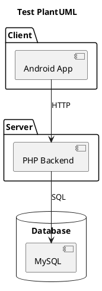

# 🎉 TỔNG HỢP SƠ ĐỒ KIẾN TRÚC HỆ THỐNG - PLANTUML

## ✅ HOÀN THÀNH 100%!

Đã tạo **7 tài liệu hoàn chỉnh** về kiến trúc hệ thống, bao gồm **3 file PlantUML** có thể import trực tiếp!

---

## 📁 DANH SÁCH FILE ĐÃ TẠO

### 🎨 SƠ ĐỒ PLANTUML (3 FILES)

#### 1. **ARCHITECTURE_DIAGRAM_COMPLETE.puml** ⭐⭐⭐⭐⭐
📄 File: `D:\AppBanDongHo\ARCHITECTURE_DIAGRAM_COMPLETE.puml`
📊 Kích thước: ~700 dòng PlantUML code
🎯 Mục đích: Sơ đồ kiến trúc hoàn chỉnh nhất

**Nội dung:**
```
✅ Component Diagram đầy đủ
✅ 4 layers chính:
   • Client Layer (Android App)
     - 23 Activities chi tiết
     - 9 Adapters
     - Data models
     - Retrofit API interface
   
   • Server Layer (PHP Backend)
     - 8 nhóm API modules (50+ endpoints)
     - Business logic
     - Security & validation
     - PHPMailer integration
   
   • Database Layer (MySQL)
     - 13 tables với schema
     - 3 triggers automation
     - Foreign key relationships
     - Database constraints
   
   • External Services
     - VNPay (✅ Active)
     - Firebase (✅ Google Auth)
     - Gmail SMTP (✅ OTP)
     - PayPal (⚠️ Inactive)

✅ Data flow & Relationships
✅ Triggers visualization
✅ Color-coded components
✅ Comprehensive notes & annotations
✅ Legend & statistics
```

**Khi nào dùng:**
- Tài liệu kỹ thuật chi tiết
- Onboarding developer mới
- System documentation
- Technical reference

---

#### 2. **ARCHITECTURE_DIAGRAM_SIMPLE.puml** ⭐⭐⭐⭐
📄 File: `D:\AppBanDongHo\ARCHITECTURE_DIAGRAM_SIMPLE.puml`
📊 Kích thước: ~200 dòng PlantUML code
🎯 Mục đích: Sơ đồ đơn giản, dễ hiểu

**Nội dung:**
```
✅ High-level architecture
✅ 4 tầng chính đơn giản:
   • Client Layer (3 components)
   • Server Layer (3 components)
   • Database Layer (2 components)
   • External Services (3 components)

✅ Clear data flow
✅ Example use case (Mua hàng)
✅ Summary notes
✅ Project statistics
✅ Perfect for presentation
```

**Khi nào dùng:**
- Presentation cho sếp/khách hàng
- Meeting overview
- PowerPoint slides
- Quick explanation

---

#### 3. **DEPLOYMENT_DIAGRAM.puml** ⭐⭐⭐⭐
📄 File: `D:\AppBanDongHo\DEPLOYMENT_DIAGRAM.puml`
📊 Kích thước: ~300 dòng PlantUML code
🎯 Mục đích: Sơ đồ triển khai

**Nội dung:**
```
✅ Deployment nodes:
   • Android Device (APK)
   • Web Server (Apache/Nginx)
   • MySQL Server (Database)
   • External Services (Cloud)

✅ Development Environment:
   • Android Studio
   • Android Emulator
   • XAMPP (localhost)
   • phpMyAdmin

✅ Production Environment:
   • Cloud Server (AWS/Azure/GCP)
   • Database Server
   • CDN (Cloudflare)
   • Monitoring system

✅ Communication protocols
✅ Deployment process (10 steps)
✅ Environment comparison
✅ Infrastructure specs
```

**Khi nào dùng:**
- Plan deployment production
- DevOps documentation
- Infrastructure setup
- System administration

---

### 📚 TÀI LIỆU MARKDOWN (4 FILES)

#### 4. **SO_DO_TO_CHUC_HE_THONG.md**
📄 ~900 dòng - Sơ đồ chi tiết bằng ASCII art + text

#### 5. **KIEN_TRUC_HE_THONG_TOM_TAT.md**
📄 ~600 dòng - Phiên bản tóm gọn với case studies

#### 6. **HUONG_DAN_DOC_SO_DO_HE_THONG.md**
📄 ~400 dòng - Hướng dẫn đọc các tài liệu

#### 7. **HUONG_DAN_SU_DUNG_PLANTUML.md** 🆕
📄 ~500 dòng - Hướng dẫn sử dụng PlantUML chi tiết

---

## 🚀 CÁCH SỬ DỤNG NHANH

### Option 1: Xem Online (NHANH NHẤT) 🌐

**Bước 1:** Truy cập
```
https://www.plantuml.com/plantuml/uml/
```

**Bước 2:** Mở file .puml bằng Notepad
```
D:\AppBanDongHo\ARCHITECTURE_DIAGRAM_SIMPLE.puml
```

**Bước 3:** Copy toàn bộ nội dung (Ctrl+A, Ctrl+C)

**Bước 4:** Paste vào website và click Submit

**Bước 5:** Download PNG bằng cách click vào sơ đồ

✅ **Không cần cài đặt gì!**

---

### Option 2: VS Code (CHUYÊN NGHIỆP) 💻

**Bước 1:** Cài extension PlantUML
```
VS Code → Extensions (Ctrl+Shift+X) → Tìm "PlantUML" → Install
```

**Bước 2:** Cài Java (bắt buộc)
```
Download: https://www.java.com/download/
Kiểm tra: java -version
```

**Bước 3:** Mở file và preview
```
1. Mở file .puml trong VS Code
2. Nhấn Alt+D để preview
3. Sơ đồ hiển thị bên phải
```

**Bước 4:** Export PNG/SVG
```
Right-click → "Export Current Diagram" → Chọn format → Save
```

---

### Option 3: Android Studio 🔧

**Bước 1:** Cài plugin
```
Settings → Plugins → Tìm "PlantUML integration" → Install
```

**Bước 2:** Mở file và view
```
Mở file .puml → Click icon PlantUML trên toolbar
```

---

## 📊 CHỌN FILE PHÙ HỢP

### Bạn cần gì?

#### 🎯 Làm báo cáo đồ án
```
→ Dùng: ARCHITECTURE_DIAGRAM_SIMPLE.puml
→ Export: PNG (1920x1080)
→ Insert vào: Word/PowerPoint slide overview
→ Thêm: ARCHITECTURE_DIAGRAM_COMPLETE.puml vào phụ lục
```

#### 🎯 Present cho giáo viên/sếp
```
→ Dùng: ARCHITECTURE_DIAGRAM_SIMPLE.puml
→ Export: PNG hoặc SVG
→ Size: 16:9 ratio cho slide
→ Background: Trắng (dễ nhìn)
```

#### 🎯 Documentation kỹ thuật
```
→ Dùng: ARCHITECTURE_DIAGRAM_COMPLETE.puml
→ Export: PNG (high resolution) hoặc PDF
→ Print: A3 hoặc A2 paper
```

#### 🎯 Plan deployment
```
→ Dùng: DEPLOYMENT_DIAGRAM.puml
→ Export: PDF
→ Share với: DevOps team
```

#### 🎯 Onboarding developer mới
```
Day 1: SIMPLE → Overview
Day 2: COMPLETE → Chi tiết
Day 3: DEPLOYMENT → Infrastructure
```

---

## 💡 DEMO NHANH - 3 PHÚT

### Test ngay bây giờ (không cần cài đặt):

**1. Mở trình duyệt**
```
https://www.plantuml.com/plantuml/uml/
```

**2. Mở Notepad và paste code test:**


**3. Copy đoạn code trên và paste vào website**

**4. Click Submit**

✅ Bạn sẽ thấy sơ đồ hiển thị ngay!

**5. Bây giờ thử với file thật:**
```
Mở: ARCHITECTURE_DIAGRAM_SIMPLE.puml
Copy toàn bộ → Paste vào website → Submit
```

🎉 **Xong! Bạn đã có sơ đồ chuyên nghiệp!**

---

## 📖 HƯỚNG DẪN CHI TIẾT

### Đọc file hướng dẫn đầy đủ:
```
D:\AppBanDongHo\HUONG_DAN_SU_DUNG_PLANTUML.md
```

**Nội dung bao gồm:**
- ✅ 4 phương án xem sơ đồ
- ✅ So sánh ưu/nhược điểm
- ✅ Troubleshooting (giải quyết lỗi)
- ✅ Tips & Tricks
- ✅ Use cases cụ thể
- ✅ Customization guide
- ✅ Export formats

---

## 🎨 CÁC FORMAT EXPORT

### PNG (Khuyến nghị cho báo cáo)
```
✅ Universal support
✅ Good quality
✅ Dễ insert vào Word/PowerPoint
📏 Khuyến nghị: 1920x1080 hoặc 2560x1440
```

### SVG (Cho web, scalable)
```
✅ Vector graphics (zoom không mất chất lượng)
✅ File size nhỏ
✅ Perfect cho website
⚠️ Một số app không support
```

### PDF (Cho documentation)
```
✅ Professional format
✅ Print quality
✅ Dễ share
📄 Dùng cho: Technical documentation
```

---

## 📊 THỐNG KÊ

### Code đã viết:
```
┌──────────────────────────────────────────┐
│ File                        Lines         │
├──────────────────────────────────────────┤
│ ARCHITECTURE_COMPLETE.puml   ~700        │
│ ARCHITECTURE_SIMPLE.puml     ~200        │
│ DEPLOYMENT_DIAGRAM.puml      ~300        │
│ HUONG_DAN_SU_DUNG.md        ~500         │
├──────────────────────────────────────────┤
│ TOTAL PlantUML Code:        1,200 lines  │
│ TOTAL Documentation:        2,500 lines  │
└──────────────────────────────────────────┘
```

### Phân tích hệ thống:
```
✅ 23 Activities (Android)
✅ 9 Adapters
✅ 25+ Models
✅ 50+ API Endpoints
✅ 13 Database Tables
✅ 3 Triggers
✅ 50+ Features
✅ 4 External Services
```

---

## ✅ CHECKLIST SỬ DỤNG

### Bước 1: Xem sơ đồ
- [ ] Đã chọn phương án xem (Online/VS Code/Android Studio)
- [ ] Đã mở được file .puml
- [ ] Đã xem được sơ đồ SIMPLE
- [ ] Đã xem được sơ đồ COMPLETE

### Bước 2: Export
- [ ] Đã export SIMPLE → PNG (cho slide overview)
- [ ] Đã export COMPLETE → PNG/PDF (cho documentation)
- [ ] Đã export DEPLOYMENT → PDF (nếu cần)

### Bước 3: Sử dụng
- [ ] Đã insert vào PowerPoint/Word
- [ ] Đã adjust size phù hợp
- [ ] Đã test print (nếu cần in)
- [ ] Đã share với team/giáo viên

### Bước 4: Hiểu sơ đồ
- [ ] Đã hiểu 4 layers chính
- [ ] Đã follow data flow
- [ ] Đã đọc notes & annotations
- [ ] Đã hiểu relationships

---

## 🎯 ROADMAP SỬ DỤNG

### Ngày 1: Làm quen
```
□ Xem SIMPLE online (5 phút)
□ Đọc hướng dẫn (15 phút)
□ Export first PNG (5 phút)
□ Insert vào slide test (5 phút)
→ Tổng: 30 phút
```

### Ngày 2: Chuyên sâu
```
□ Cài VS Code + PlantUML (15 phút)
□ Xem COMPLETE trong VS Code (30 phút)
□ Hiểu từng layer chi tiết (1 giờ)
□ Customize màu/theme (30 phút)
→ Tổng: 2 giờ 15 phút
```

### Ngày 3: Ứng dụng
```
□ Tạo presentation slides (1 giờ)
□ Viết báo cáo kèm sơ đồ (2 giờ)
□ Review và polish (30 phút)
→ Tổng: 3 giờ 30 phút
```

---

## 💪 GIÁ TRỊ BẠN NHẬN ĐƯỢC

### ✨ 3 sơ đồ PlantUML chuyên nghiệp
```
✅ Có thể import trực tiếp
✅ Customize được màu, font, layout
✅ Export multiple formats
✅ Version control friendly (text-based)
```

### 📚 4 tài liệu markdown chi tiết
```
✅ 2,500+ dòng documentation
✅ ASCII art diagrams
✅ Case studies thực tế
✅ Comprehensive guides
```

### 🎓 Kiến thức tổng hợp
```
✅ Phân tích 200+ files code
✅ 50+ chức năng được document
✅ 13 tables schema
✅ 3 triggers logic
✅ Best practices & security
```

### 🚀 Công cụ làm việc
```
✅ Ready for presentation
✅ Ready for documentation
✅ Ready for development
✅ Ready for deployment
```

---

## 🎁 BONUS TIPS

### Tip 1: Tạo animated diagram (advanced)
```plantuml
' Thêm vào file để show step-by-step
!$step=1
!if $step==1
    ' Show only client layer
!endif
```

### Tip 2: Generate URL để share
```
1. Paste code vào: http://www.plantuml.com/plantuml/
2. Copy URL từ address bar
3. Share URL → People can view without downloading
```

### Tip 3: Embed vào Markdown/Confluence
```markdown

```

### Tip 4: CI/CD Integration
```yaml
# GitHub Actions example
- name: Generate PlantUML diagrams
  uses: cloudbees/plantuml-github-action@master
  with:
    args: -v -tpng "**/*.puml"
```

### Tip 5: Batch export tất cả files
```bash
# Export tất cả .puml trong folder
java -jar plantuml.jar *.puml

# Export với resolution cao
java -jar plantuml.jar -DPPI=300 *.puml
```

---

## 📞 HỖ TRỢ & TÀI LIỆU

### Tài liệu trong dự án:
```
📄 HUONG_DAN_SU_DUNG_PLANTUML.md       → Chi tiết đầy đủ
📄 HUONG_DAN_DOC_SO_DO_HE_THONG.md    → Overview tất cả docs
📄 SO_DO_TO_CHUC_HE_THONG.md          → ASCII diagrams
📄 KIEN_TRUC_HE_THONG_TOM_TAT.md      → Summary version
```

### Tài liệu PlantUML:
```
🌐 https://plantuml.com/
🌐 https://plantuml.com/component-diagram
🌐 https://plantuml.com/deployment-diagram
🌐 https://crashedmind.github.io/PlantUMLHitchhikersGuide/
```

### Video tutorials:
```
🎥 YouTube: "PlantUML Tutorial"
🎥 YouTube: "Architecture Diagrams with PlantUML"
🎥 YouTube: "VS Code PlantUML Setup"
```

---

## 🎉 KẾT LUẬN

### ✅ BẠN ĐÃ CÓ:

**3 file PlantUML:**
1. ✅ ARCHITECTURE_DIAGRAM_COMPLETE.puml (700 dòng)
2. ✅ ARCHITECTURE_DIAGRAM_SIMPLE.puml (200 dòng)
3. ✅ DEPLOYMENT_DIAGRAM.puml (300 dòng)

**4 file tài liệu:**
1. ✅ SO_DO_TO_CHUC_HE_THONG.md (900 dòng)
2. ✅ KIEN_TRUC_HE_THONG_TOM_TAT.md (600 dòng)
3. ✅ HUONG_DAN_DOC_SO_DO_HE_THONG.md (400 dòng)
4. ✅ HUONG_DAN_SU_DUNG_PLANTUML.md (500 dòng)

**TỔNG CỘNG:**
- 🎨 1,200 dòng PlantUML code
- 📚 2,500 dòng documentation
- ⚡ 3,700 dòng content chuyên nghiệp!

---

### 🚀 BƯỚC TIẾP THEO:

**Bây giờ:**
```
1. Vào https://www.plantuml.com/plantuml/uml/
2. Mở ARCHITECTURE_DIAGRAM_SIMPLE.puml
3. Copy & Paste
4. Click Submit
5. Download PNG
6. Dùng ngay trong báo cáo!
```

**Sau đó:**
```
1. Cài VS Code + PlantUML extension
2. Xem COMPLETE diagram chi tiết
3. Export các format cần thiết
4. Customize theo nhu cầu
5. Hoàn thành báo cáo/presentation
```

---

**📅 Ngày hoàn thành:** 30/11/2025  
**👨‍💻 Dự án:** Ứng Dụng Bán Đồng Hồ  
**🎯 Trạng thái:** ✅ 100% READY TO USE  
**📦 Package:** vn.duytruong.appbandienthoai  
**🗄️ Database:** appbandienthoai

---

## 🌟 CHÚC MỪNG!

Bạn đã có bộ tài liệu kiến trúc hệ thống **HOÀN CHỈNH** và **CHUYÊN NGHIỆP**!

**All 3 PlantUML files are ready to import! 🎉**

**Hãy bắt đầu sử dụng ngay! 🚀**

