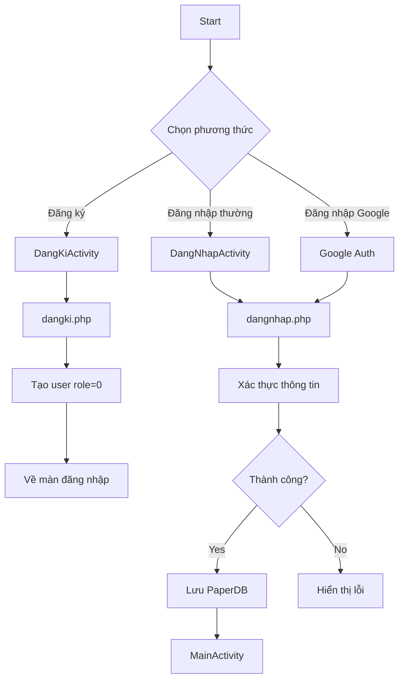
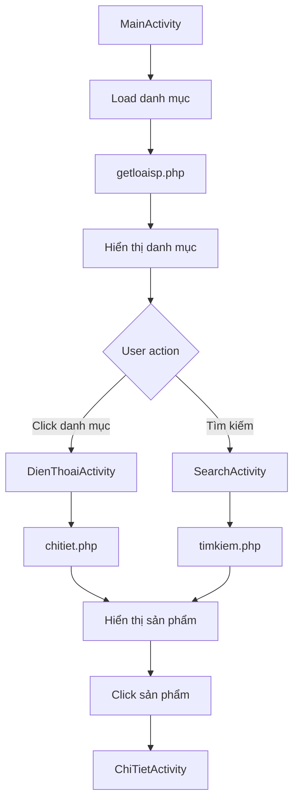
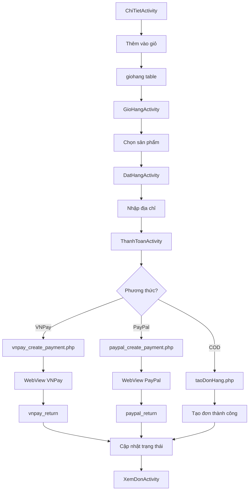
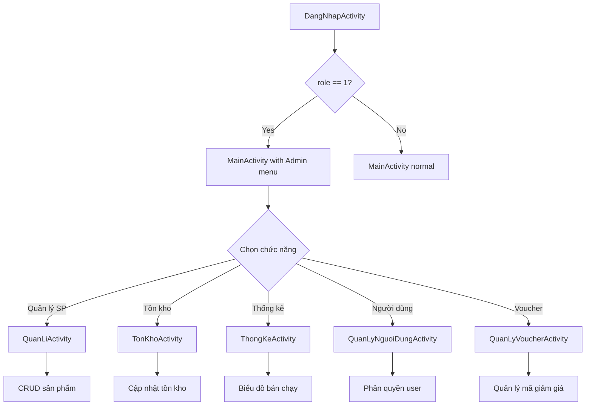

# 🏗️ SƠ ĐỒ TỔ CHỨC HỆ THỐNG - ỨNG DỤNG BÁN ĐỒNG HỒ

**Ngày tạo:** 30/11/2025  
**Loại hệ thống:** E-commerce Mobile Application  
**Kiến trúc:** Client-Server (3-tier Architecture)

---

## 📊 TỔNG QUAN KIẾN TRÚC HỆ THỐNG

```
┌─────────────────────────────────────────────────────────────────────┐
│                        CLIENT LAYER (Android App)                    │
│                                                                       │
│  ┌──────────────┐  ┌──────────────┐  ┌──────────────┐              │
│  │  UI Layer    │  │ Business     │  │   Data       │              │
│  │ (Activities) │──│   Logic      │──│   Layer      │              │
│  │              │  │ (Adapters)   │  │ (Models)     │              │
│  └──────────────┘  └──────────────┘  └──────────────┘              │
│           │                 │                 │                      │
│           └─────────────────┴─────────────────┘                     │
│                             │                                        │
│                    ┌────────▼────────┐                              │
│                    │  Retrofit API   │                              │
│                    │  (HTTP Client)  │                              │
│                    └────────┬────────┘                              │
└─────────────────────────────┼───────────────────────────────────────┘
                              │
                    ══════════╪═══════════════
                         INTERNET (HTTP/HTTPS)
                    ══════════╪═══════════════
                              │
┌─────────────────────────────▼───────────────────────────────────────┐
│                     SERVER LAYER (PHP Backend)                       │
│                                                                       │
│  ┌──────────────────────────────────────────────────────────────┐  │
│  │                    API Endpoints (REST)                       │  │
│  │  ┌─────────┐ ┌─────────┐ ┌─────────┐ ┌─────────┐            │  │
│  │  │ Auth    │ │Product  │ │ Order   │ │ Payment │            │  │
│  │  │ APIs    │ │ APIs    │ │ APIs    │ │ APIs    │            │  │
│  │  └─────────┘ └─────────┘ └─────────┘ └─────────┘            │  │
│  └──────────────────────────┬───────────────────────────────────┘  │
│                              │                                       │
│  ┌──────────────────────────▼───────────────────────────────────┐  │
│  │              Business Logic Layer (PHP Scripts)              │  │
│  │  • Validation  • Authentication  • Authorization             │  │
│  │  • Data Processing  • File Upload  • Email Sending           │  │
│  └──────────────────────────┬───────────────────────────────────┘  │
│                              │                                       │
│  ┌──────────────────────────▼───────────────────────────────────┐  │
│  │           Database Access Layer (MySQLi)                     │  │
│  │  • Connection Management  • CRUD Operations                  │  │
│  │  • Transaction Management  • Triggers                        │  │
│  └──────────────────────────┬───────────────────────────────────┘  │
└─────────────────────────────┼───────────────────────────────────────┘
                              │
┌─────────────────────────────▼───────────────────────────────────────┐
│                    DATABASE LAYER (MySQL)                            │
│                                                                       │
│  ┌─────────────┐  ┌─────────────┐  ┌─────────────┐                │
│  │   Tables    │  │  Triggers   │  │   Views     │                │
│  │  (13 bảng)  │  │  (3 cái)    │  │  (tùy chọn) │                │
│  └─────────────┘  └─────────────┘  └─────────────┘                │
└──────────────────────────────────────────────────────────────────────┘

┌─────────────────────────────────────────────────────────────────────┐
│               EXTERNAL SERVICES (Dịch vụ bên ngoài)                  │
│                                                                       │
│  ┌──────────────┐  ┌──────────────┐  ┌──────────────┐              │
│  │   VNPay      │  │   PayPal     │  │   Firebase   │              │
│  │  (Payment)   │  │  (Payment)   │  │     (FCM)    │              │
│  └──────────────┘  └──────────────┘  └──────────────┘              │
│                                                                       │
│  ┌──────────────┐  ┌──────────────┐                                │
│  │   PHPMailer  │  │  Google Auth │                                │
│  │   (Email)    │  │  (OAuth 2.0) │                                │
│  └──────────────┘  └──────────────┘                                │
└──────────────────────────────────────────────────────────────────────┘
```

---

## 🎯 CHI TIẾT CÁC TẦNG (LAYERS)

## 1️⃣ CLIENT LAYER - ANDROID APPLICATION

### 📱 Cấu trúc Package
```
vn.duytruong.appbandienthoai/
├── activity/              # 23 Activities (UI Screens)
│   ├── DangNhapActivity.java
│   ├── DangKiActivity.java
│   ├── MainActivity.java
│   ├── ChiTietActivity.java
│   ├── GioHangActivity.java
│   ├── DatHangActivity.java
│   ├── ThanhToanActivity.java
│   ├── DonHangActivity.java
│   ├── XemDonActivity.java
│   ├── ChiTietDonHangActivity.java
│   ├── SearchActivity.java
│   ├── ResetPassActivity.java
│   ├── UpdateProfileActivity.java
│   ├── QuanLiActivity.java      # Admin only
│   ├── ThemSPActivity.java      # Admin only
│   ├── TonKhoActivity.java      # Admin only
│   ├── ThongKeActivity.java     # Admin only
│   ├── ThongKeDoanhThuActivity.java  # Admin only
│   ├── QuanLyNguoiDungActivity.java  # Admin only
│   ├── QuanLyVoucherActivity.java    # Admin only
│   ├── ChonVoucherActivity.java
│   ├── DienThoaiActivity.java
│   └── LaptopActivity.java
│
├── adapter/               # RecyclerView Adapters
│   ├── SanPhamMoiAdapter.java
│   ├── LoaiSpAdapter.java
│   ├── GioHangAdapter.java
│   ├── DonHangAdapter.java
│   ├── ChiTietDonHangAdapter.java
│   ├── NguoiDungAdapter.java
│   ├── VoucherAdminAdapter.java
│   ├── VoucherUserAdapter.java
│   └── TonKhoAdapter.java
│
├── model/                 # Data Models (POJOs)
│   ├── User.java
│   ├── SanPhamMoi.java
│   ├── LoaiSp.java
│   ├── GioHang.java
│   ├── DonHang.java
│   ├── ChiTietDonHang.java
│   ├── Voucher.java
│   ├── TonKhoItem.java
│   ├── ThongKe.java
│   ├── VNPayResponse.java
│   ├── PayPalResponse.java
│   └── MessageModel.java
│
├── retrofit/              # API Client
│   ├── ApiBanHang.java    # API Interface (40+ endpoints)
│   └── RetrofitClient.java # HTTP Client setup
│
├── utils/                 # Utilities
│   ├── Utils.java         # Constants, shared data
│   └── AppInfo.java
│
├── Service/               # Background Services
│   └── FirebaseMessagerReceiver.java  # Push notifications
│
├── Interface/             # Callback Interfaces
│   ├── ItemClickListener.java
│   └── IImageClickListenner.java
│
└── zalo/                  # ZaloPay integration (chưa hoàn thiện)
    └── Helper/
```

### 🔌 Retrofit API Client
**Base URL:** `http://10.0.2.2/appbandienthoai/Server/` (Emulator)

**Tổng số API endpoints:** 40+

---

## 2️⃣ SERVER LAYER - PHP BACKEND

### 📁 Cấu trúc thư mục Server/
```
Server/
├── connect.php                    # Database connection
├── config/
│   ├── vnpay_config.php          # VNPay credentials
│   ├── paypal_config.php         # PayPal credentials
│   └── email_config.php          # SMTP config
│
├── Authentication/                # Xác thực & Phân quyền
│   ├── dangki.php                # POST: Đăng ký
│   ├── dangnhap.php              # POST: Đăng nhập (normal + Google)
│   ├── reset_pass.php            # POST: Gửi OTP reset password
│   └── verify_otp_reset_pass.php # POST: Xác thực OTP + reset pass
│
├── Product/                       # Quản lý sản phẩm
│   ├── getspmoi.php              # GET: Danh sách sản phẩm mới
│   ├── getloaisp.php             # GET: Danh sách loại sản phẩm
│   ├── chitiet.php               # POST: Chi tiết sản phẩm theo loại
│   ├── timkiem.php               # POST: Tìm kiếm sản phẩm
│   ├── insertsp.php              # POST: Thêm sản phẩm (Admin)
│   ├── updatesp.php              # POST: Sửa sản phẩm (Admin)
│   └── xoa.php                   # POST: Xóa sản phẩm (Admin)
│
├── Inventory/                     # Quản lý tồn kho
│   ├── kiemTraTonKho.php         # GET: Kiểm tra tồn kho
│   └── capNhatTonKho.php         # POST: Cập nhật tồn kho (Admin)
│
├── Order/                         # Quản lý đơn hàng
│   ├── taoDonHang.php            # POST: Tạo đơn hàng (COD)
│   ├── xemdonhang.php            # POST: Xem đơn hàng (User/Admin)
│   ├── getChiTietDonHang.php     # POST: Chi tiết đơn hàng
│   ├── huyDonHang.php            # POST: Hủy đơn hàng
│   ├── updateorder.php           # POST: Cập nhật trạng thái (Admin)
│   └── capNhatTrangThai.php      # POST: Cập nhật trạng thái
│
├── Payment/                       # Thanh toán
│   ├── VNPay/
│   │   ├── vnpay_create_payment.php      # Tạo link thanh toán VNPay
│   │   ├── vnpay_return.php              # Callback từ VNPay
│   │   ├── vnpay_check_status.php        # Kiểm tra trạng thái
│   │   └── vnpay_continue_payment.php    # Tiếp tục thanh toán
│   │
│   └── PayPal/
│       ├── paypal_create_payment.php     # Tạo PayPal order
│       ├── paypal_execute_payment.php    # Execute payment
│       ├── paypal_check_status.php       # Check status
│       ├── paypal_return.php             # Success callback
│       └── paypal_cancel.php             # Cancel callback
│
├── Voucher/                       # Quản lý mã giảm giá
│   ├── getVouchers.php           # GET: Danh sách voucher
│   ├── checkVoucher.php          # POST: Kiểm tra voucher hợp lệ
│   └── saveVoucherUsage.php      # POST: Lưu lịch sử sử dụng
│
├── User/                          # Quản lý người dùng
│   ├── getAllUsers.php           # GET: Danh sách user (Admin)
│   ├── updateUserRole.php        # POST: Cập nhật role (Admin)
│   ├── updateUserStatus.php      # POST: Cập nhật trạng thái (Admin)
│   ├── deleteUser.php            # POST: Xóa user (Admin)
│   ├── createUser.php            # POST: Tạo user (Admin)
│   └── updateProfile.php         # POST: Cập nhật thông tin cá nhân
│
├── Statistics/                    # Thống kê
│   ├── thongke.php               # GET: Thống kê sản phẩm bán chạy
│   └── thongke_doanhthu.php      # GET: Thống kê doanh thu
│
└── PHPMailer/                     # Thư viện gửi email
    └── src/
        ├── PHPMailer.php
        ├── SMTP.php
        └── Exception.php
```

### 🔐 Bảo mật & Validation
- ✅ SQL Injection prevention (mysqli_real_escape_string)
- ✅ XSS protection (htmlspecialchars)
- ✅ Role-based access control (Admin/User)
- ✅ Session validation (PaperDB)
- ✅ HTTPS ready
- ✅ CORS headers

---

## 3️⃣ DATABASE LAYER - MYSQL

### 📊 Database Schema: `appbandienthoai`

#### **Danh sách Tables (13 bảng)**

```sql
-- 1. USER TABLE (Người dùng)
CREATE TABLE `user` (
    `id` INT PRIMARY KEY AUTO_INCREMENT,
    `email` VARCHAR(255) UNIQUE NOT NULL,
    `pass` VARCHAR(255),  -- NULL nếu đăng nhập Google
    `username` VARCHAR(100),
    `mobile` VARCHAR(20),
    `role` INT DEFAULT 0,  -- 0=User, 1=Admin
    `login_type` ENUM('normal','google') DEFAULT 'normal',
    `account_status` TINYINT DEFAULT 1,  -- 1=active, 0=disabled
    `reset_otp` VARCHAR(10),  -- OTP reset password
    `reset_otp_expiry` DATETIME,  -- Thời gian hết hạn OTP
    `created_at` TIMESTAMP DEFAULT CURRENT_TIMESTAMP
);

-- 2. LOAISP TABLE (Loại sản phẩm)
CREATE TABLE `loaisp` (
    `id` INT PRIMARY KEY AUTO_INCREMENT,
    `tensanpham` VARCHAR(255) NOT NULL,  -- VD: Đồng hồ cơ, Đồng hồ điện tử
    `hinhanh` VARCHAR(255)
);

-- 3. SANPHAMMOI TABLE (Sản phẩm)
CREATE TABLE `sanphammoi` (
    `id` INT PRIMARY KEY AUTO_INCREMENT,
    `tensp` VARCHAR(255) NOT NULL,
    `giasp` VARCHAR(100),
    `hinhanh` TEXT,  -- URL hoặc filename
    `mota` TEXT,
    `loai` INT,  -- FK -> loaisp.id
    `soluong` INT DEFAULT 0,  -- Số lượng đã bán
    `soluongtonkho` INT DEFAULT 0,  -- Tồn kho hiện tại
    `created_at` TIMESTAMP DEFAULT CURRENT_TIMESTAMP,
    FOREIGN KEY (`loai`) REFERENCES `loaisp`(`id`)
);

-- 4. GIOHANG TABLE (Giỏ hàng)
CREATE TABLE `giohang` (
    `id` INT PRIMARY KEY AUTO_INCREMENT,
    `iduser` INT NOT NULL,
    `idsp` INT NOT NULL,
    `tensp` VARCHAR(255),
    `giasp` VARCHAR(100),
    `hinhanh` TEXT,
    `soluong` INT DEFAULT 1,
    `ngaythem` TIMESTAMP DEFAULT CURRENT_TIMESTAMP,
    FOREIGN KEY (`iduser`) REFERENCES `user`(`id`) ON DELETE CASCADE,
    FOREIGN KEY (`idsp`) REFERENCES `sanphammoi`(`id`) ON DELETE CASCADE
);

-- 5. DONHANG TABLE (Đơn hàng)
CREATE TABLE `donhang` (
    `id` INT PRIMARY KEY AUTO_INCREMENT,
    `madonhang` VARCHAR(50) UNIQUE NOT NULL,  -- DH20241130123456789
    `iduser` INT NOT NULL,
    `diachi` TEXT NOT NULL,
    `sodienthoai` VARCHAR(20) NOT NULL,
    `soluong` INT NOT NULL,
    `tongtien` VARCHAR(100) NOT NULL,
    `ngaydat` DATETIME DEFAULT CURRENT_TIMESTAMP,
    `ngaygiaodukien` VARCHAR(100),
    `trangthai` VARCHAR(50) DEFAULT 'Chờ xử lý',  -- Chờ xử lý, Đang giao, Đã giao, Đã hủy
    `phuongthucthanhtoan` VARCHAR(50) DEFAULT 'COD',  -- COD, VNPay, PayPal
    
    -- VNPay fields
    `vnpay_txn_ref` VARCHAR(100),  -- Mã giao dịch VNPay
    `vnpay_transaction_no` VARCHAR(100),
    `vnpay_payment_date` DATETIME,
    
    -- PayPal fields
    `paypal_order_id` VARCHAR(100),
    `paypal_payer_id` VARCHAR(100),
    `paypal_payment_date` DATETIME,
    
    -- Voucher fields
    `voucher_id` INT,  -- FK -> voucher.id
    `ma_voucher` VARCHAR(50),
    `gia_tri_giam` DECIMAL(10,2) DEFAULT 0,
    `tong_truoc_giam` DECIMAL(10,2),
    
    `lydo_huy` TEXT,
    `created_at` TIMESTAMP DEFAULT CURRENT_TIMESTAMP,
    FOREIGN KEY (`iduser`) REFERENCES `user`(`id`),
    FOREIGN KEY (`voucher_id`) REFERENCES `voucher`(`id`)
);

-- 6. CHITIETDONHANG TABLE (Chi tiết đơn hàng)
CREATE TABLE `chitietdonhang` (
    `id` INT PRIMARY KEY AUTO_INCREMENT,
    `iddonhang` INT NOT NULL,
    `idsp` INT NOT NULL,
    `soluong` INT NOT NULL,
    `gia` VARCHAR(100) NOT NULL,
    FOREIGN KEY (`iddonhang`) REFERENCES `donhang`(`id`) ON DELETE CASCADE,
    FOREIGN KEY (`idsp`) REFERENCES `sanphammoi`(`id`)
);

-- 7. VOUCHER TABLE (Mã giảm giá)
CREATE TABLE `voucher` (
    `id` INT PRIMARY KEY AUTO_INCREMENT,
    `ma_voucher` VARCHAR(50) UNIQUE NOT NULL,  -- NEWUSER10, FREESHIP50K
    `ten_voucher` VARCHAR(200) NOT NULL,
    `mo_ta` TEXT,
    `loai_giam` ENUM('percent','fixed','freeship') DEFAULT 'percent',
    `gia_tri_giam` DECIMAL(10,2) NOT NULL,  -- 10 = 10% hoặc 10,000 VND
    `giam_toi_da` DECIMAL(10,2),  -- Giảm tối đa (với loại %)
    `don_toi_thieu` DECIMAL(10,2) DEFAULT 0,  -- Đơn hàng tối thiểu
    `ap_dung_cho` ENUM('all','new_user','old_user','first_order') DEFAULT 'all',
    `so_luong` INT,  -- NULL = không giới hạn
    `da_su_dung` INT DEFAULT 0,
    `gioi_han_moi_user` INT DEFAULT 1,
    `ngay_bat_dau` DATETIME NOT NULL,
    `ngay_het_han` DATETIME NOT NULL,
    `trang_thai` TINYINT DEFAULT 1,  -- 1=active, 0=inactive
    `created_at` TIMESTAMP DEFAULT CURRENT_TIMESTAMP
);

-- 8. VOUCHER_USAGE TABLE (Lịch sử sử dụng voucher)
CREATE TABLE `voucher_usage` (
    `id` INT PRIMARY KEY AUTO_INCREMENT,
    `voucher_id` INT NOT NULL,
    `user_id` INT NOT NULL,
    `donhang_id` INT,
    `ma_donhang` VARCHAR(50),
    `gia_tri_don_hang` DECIMAL(10,2) NOT NULL,
    `gia_tri_giam` DECIMAL(10,2) NOT NULL,
    `ngay_su_dung` TIMESTAMP DEFAULT CURRENT_TIMESTAMP,
    FOREIGN KEY (`voucher_id`) REFERENCES `voucher`(`id`),
    FOREIGN KEY (`user_id`) REFERENCES `user`(`id`),
    FOREIGN KEY (`donhang_id`) REFERENCES `donhang`(`id`)
);
```

### 🔄 Database Triggers (3 triggers)

```sql
-- TRIGGER 1: Tự động giảm tồn kho khi tạo chi tiết đơn hàng
DELIMITER $$
CREATE TRIGGER `after_chitietdonhang_insert_giam_tonkho`
AFTER INSERT ON `chitietdonhang`
FOR EACH ROW
BEGIN
    UPDATE sanphammoi 
    SET soluongtonkho = soluongtonkho - NEW.soluong,
        soluong = soluong + NEW.soluong
    WHERE id = NEW.idsp;
END$$
DELIMITER ;

-- TRIGGER 2: Hoàn tồn kho khi hủy đơn hàng
DELIMITER $$
CREATE TRIGGER `after_donhang_update_hoan_tonkho`
AFTER UPDATE ON `donhang`
FOR EACH ROW
BEGIN
    IF NEW.trangthai = 'Đã hủy' AND OLD.trangthai != 'Đã hủy' THEN
        UPDATE sanphammoi sp
        INNER JOIN chitietdonhang ct ON sp.id = ct.idsp
        SET sp.soluongtonkho = sp.soluongtonkho + ct.soluong,
            sp.soluong = sp.soluong - ct.soluong
        WHERE ct.iddonhang = NEW.id;
    END IF;
END$$
DELIMITER ;

-- TRIGGER 3: Tăng số lượng voucher đã sử dụng
DELIMITER $$
CREATE TRIGGER `after_donhang_insert_update_voucher`
AFTER INSERT ON `donhang`
FOR EACH ROW
BEGIN
    IF NEW.voucher_id IS NOT NULL THEN
        UPDATE voucher 
        SET da_su_dung = da_su_dung + 1
        WHERE id = NEW.voucher_id;
    END IF;
END$$
DELIMITER ;
```

---

## 4️⃣ EXTERNAL SERVICES - DỊCH VỤ BÊN NGOÀI

### 💳 VNPay (Cổng thanh toán)
**Trạng thái:** ✅ Đã tích hợp hoàn chỉnh

**Luồng hoạt động:**
```
1. User chọn sản phẩm → Checkout
2. App gọi: vnpay_create_payment.php
3. Server tạo đơn hàng + tạo payment link VNPay
4. App mở WebView với payment link
5. User thanh toán trên VNPay
6. VNPay redirect về: appbandienthoai://payment_return
7. App gọi: vnpay_check_status.php
8. Cập nhật trạng thái đơn hàng → "Đã thanh toán"
```

**Files:**
- `vnpay_config.php` - Config
- `vnpay_create_payment.php` - Tạo payment
- `vnpay_return.php` - Callback
- `vnpay_check_status.php` - Kiểm tra
- `vnpay_continue_payment.php` - Tiếp tục thanh toán

---

### 💵 PayPal (Cổng thanh toán)
**Trạng thái:** ⚠️ Có code nhưng chưa hoạt động đầy đủ

**Files:**
- `paypal_config.php`
- `paypal_create_payment.php`
- `paypal_execute_payment.php`
- `paypal_check_status.php`
- `paypal_return.php`
- `paypal_cancel.php`

---

### 🔔 Firebase Cloud Messaging (FCM)
**Trạng thái:** ⚠️ Đã setup nhưng chưa sử dụng đầy đủ

**Chức năng:**
- ✅ Lấy FCM token khi app khởi động
- ✅ Service receiver: `FirebaseMessagerReceiver.java`
- ❌ Backend chưa gửi notification
- ❌ Chưa có lịch sử thông báo trong app

**Files:**
- `app/google-services.json`
- `FirebaseMessagerReceiver.java`

---

### 🔐 Google Sign-In (OAuth 2.0)
**Trạng thái:** ✅ Hoạt động tốt

**Luồng:**
```
1. User click "Đăng nhập Google"
2. Chọn tài khoản Google
3. Firebase Authentication xác thực
4. App gọi: dangnhap.php với login_type=google
5. Server tạo/cập nhật user với role=0
6. Trả về thông tin user cho app
```

---

### 📧 PHPMailer (Gửi email)
**Trạng thái:** ✅ Hoạt động

**Sử dụng cho:**
- Gửi OTP reset password
- (Có thể mở rộng: gửi thông báo đơn hàng, xác thực email)

**Config:**
- SMTP: Gmail
- Port: 587 (TLS)
- File: `email_config.php`

---

## 🔄 LUỒNG DỮ LIỆU (DATA FLOW)

### 📱 Luồng đăng nhập
```
[DangNhapActivity] 
    → [RetrofitClient.ApiBanHang.dangNhap()] 
    → HTTP POST → [Server/dangnhap.php]
    → [MySQL: SELECT * FROM user WHERE email=? AND pass=?]
    → Response JSON: {success, user: {id, email, username, mobile, role}}
    → [PaperDB: lưu user]
    → [MainActivity]
```

### 🛒 Luồng mua hàng (COD)
```
[GioHangActivity: Chọn sản phẩm]
    → [DatHangActivity: Nhập địa chỉ]
    → [ThanhToanActivity: Chọn COD]
    → HTTP POST → [Server/taoDonHang.php]
        → BEGIN TRANSACTION
        → INSERT INTO donhang (...)
        → INSERT INTO chitietdonhang (...) 
            → TRIGGER: giảm soluongtonkho
        → INSERT INTO voucher_usage (nếu có voucher)
        → COMMIT
    → Response: {success, madonhang}
    → [XemDonActivity: Hiển thị đơn hàng]
```

### 💳 Luồng thanh toán VNPay
```
[ThanhToanActivity: Chọn VNPay]
    → HTTP POST → [Server/vnpay_create_payment.php]
        → Tạo đơn hàng với trangthai="Chờ thanh toán"
        → Tạo VNPay payment URL
    → Response: {success, payment_url, madonhang}
    → [WebView: mở payment_url]
    → User thanh toán trên VNPay
    → VNPay callback: appbandienthoai://payment_return?vnp_ResponseCode=00&vnp_TxnRef=...
    → [XemDonActivity: onNewIntent]
    → HTTP POST → [Server/vnpay_check_status.php]
        → Verify signature
        → UPDATE donhang SET trangthai='Đã thanh toán'
    → [XemDonActivity: Reload danh sách đơn hàng]
```

### 📊 Luồng quản lý admin
```
[MainActivity: Check role=1]
    → [Menu: Hiển thị mục Admin]
    → [QuanLiActivity]
        ├── [ThemSPActivity: Thêm sản phẩm]
        │   → HTTP POST → insertsp.php
        ├── [TonKhoActivity: Quản lý tồn kho]
        │   → HTTP GET → kiemTraTonKho.php
        ├── [ThongKeActivity: Biểu đồ bán chạy]
        │   → HTTP GET → thongke.php
        ├── [QuanLyNguoiDungActivity: Quản lý user]
        │   → HTTP GET → getAllUsers.php
        │   → HTTP POST → updateUserRole.php
        └── [QuanLyVoucherActivity: Quản lý voucher]
            → HTTP GET → getVouchers.php
```

---

## 📊 SƠ ĐỒ LUỒNG NGHIỆP VỤ CHÍNH

### 1. Đăng ký & Đăng nhập


### 2. Xem & Tìm sản phẩm


### 3. Mua hàng


### 4. Quản lý admin


---

## 🔒 BẢO MẬT & PHÂN QUYỀN

### Hệ thống phân quyền
```
┌──────────────────────────────────────────────────────┐
│                   AUTHENTICATION                      │
│                                                       │
│  User Login → Verify → Get role from DB              │
│                                                       │
│  ┌─────────────┐              ┌─────────────┐       │
│  │ role = 0    │              │  role = 1   │       │
│  │  (USER)     │              │  (ADMIN)    │       │
│  └──────┬──────┘              └──────┬──────┘       │
│         │                            │               │
└─────────┼────────────────────────────┼───────────────┘
          │                            │
          ▼                            ▼
┌──────────────────┐      ┌────────────────────────────┐
│  USER FEATURES   │      │    ADMIN FEATURES          │
├──────────────────┤      ├────────────────────────────┤
│ • Xem sản phẩm   │      │ • TẤT CẢ chức năng User    │
│ • Tìm kiếm       │      │ • CRUD sản phẩm            │
│ • Giỏ hàng       │      │ • Quản lý tồn kho          │
│ • Đặt hàng       │      │ • Xem TẤT CẢ đơn hàng      │
│ • Thanh toán     │      │ • Cập nhật trạng thái DH   │
│ • Xem đơn hàng   │      │ • Quản lý người dùng       │
│   của mình       │      │ • Phân quyền admin         │
│ • Hủy đơn hàng   │      │ • Quản lý voucher          │
│ • Sử dụng voucher│      │ • Xem thống kê             │
│ • Cập nhật TT CN │      │ • Xem biểu đồ doanh thu    │
└──────────────────┘      └────────────────────────────┘
```

### Check phân quyền trong code

**Android (Java):**
```java
// Utils.java
public class Utils {
    public static User user_current = null;
}

// MainActivity.java
if (Utils.user_current != null && Utils.user_current.isAdmin()) {
    // Hiển thị menu admin
    menu.findItem(R.id.menu_admin).setVisible(true);
}

// User.java
public boolean isAdmin() {
    return this.role == 1;
}
```

**PHP Backend:**
```php
// getAllUsers.php (Admin only)
if (!isset($_SESSION['user_role']) || $_SESSION['user_role'] != 1) {
    echo json_encode([
        'success' => false,
        'message' => 'Bạn không có quyền truy cập'
    ]);
    exit;
}
```

---

## 📈 THỐNG KÊ DỰ ÁN

### Quy mô code
```
┌─────────────────────────────────────────────┐
│              CLIENT (Android)                │
├─────────────────────────────────────────────┤
│ Activities:        23 files                  │
│ Adapters:          9 files                   │
│ Models:            25+ files                 │
│ API Endpoints:     40+ endpoints             │
│ Total Java files:  ~80 files                 │
└─────────────────────────────────────────────┘

┌─────────────────────────────────────────────┐
│              SERVER (PHP)                    │
├─────────────────────────────────────────────┤
│ API Scripts:       50+ PHP files             │
│ Config files:      5 files                   │
│ External libs:     PHPMailer                 │
└─────────────────────────────────────────────┘

┌─────────────────────────────────────────────┐
│            DATABASE (MySQL)                  │
├─────────────────────────────────────────────┤
│ Tables:            13 bảng                   │
│ Triggers:          3 triggers                │
│ SQL scripts:       20+ files                 │
└─────────────────────────────────────────────┘
```

### Tính năng chính
```
✅ Xác thực & Phân quyền:        7 chức năng
✅ Quản lý sản phẩm:             8 chức năng
✅ Giỏ hàng & Đặt hàng:          10 chức năng
✅ Thanh toán:                   3 phương thức (COD, VNPay, PayPal*)
✅ Quản lý đơn hàng:             6 chức năng
✅ Voucher/Mã giảm giá:          5 chức năng
✅ Quản lý người dùng (Admin):   5 chức năng
✅ Thống kê (Admin):             2 loại biểu đồ
✅ Tồn kho:                      3 chức năng
✅ Tìm kiếm:                     1 chức năng
──────────────────────────────────────────────
   TỔNG CỘNG:                    50+ chức năng
```

---

## 🎨 CÔNG NGHỆ SỬ DỤNG

### Frontend (Android)
```
• Language:          Java
• Min SDK:           API 24 (Android 7.0)
• Target SDK:        API 34 (Android 14)
• Build Tool:        Gradle 8.7
• Architecture:      MVC pattern
```

### Libraries & Dependencies
```
• Retrofit 2.9.0        → HTTP Client
• RxJava 2.2.21         → Reactive programming
• Glide 4.16.0          → Image loading
• PaperDB 2.7.2         → Local storage (NoSQL)
• EventBus 3.3.1        → Event-driven communication
• MPAndroidChart 3.1.0  → Biểu đồ thống kê
• Firebase:
  - FCM                 → Push notifications
  - Auth                → Google Sign-In
• Google Sign-In        → OAuth 2.0
• Nex3z Badge 1.0.4     → Notification badge
• Material Design       → UI Components
```

### Backend (PHP)
```
• PHP Version:       7.4+
• Database:          MySQL 5.7+
• Server:            Apache/Nginx
• Libraries:
  - PHPMailer        → Email sending
  - MySQLi           → Database driver
```

### External APIs
```
• VNPay Sandbox      → Payment gateway
• PayPal REST API    → Payment gateway (inactive)
• Firebase Cloud     → Push notifications
• Google OAuth 2.0   → Social login
```

---

## 🚀 DEPLOYMENT & ENVIRONMENT

### Development
```
┌──────────────────────────────────────────┐
│          DEVELOPMENT SETUP               │
├──────────────────────────────────────────┤
│ IDE:          Android Studio Koala       │
│ Emulator:     Pixel 6 API 34             │
│ Local Server: XAMPP (Apache + MySQL)     │
│ Base URL:     http://10.0.2.2/          │
│               appbandienthoai/Server/    │
│ Database:     phpMyAdmin                 │
└──────────────────────────────────────────┘
```

### Testing với ngrok (cho VNPay callback)
```
┌──────────────────────────────────────────┐
│          NGROK TUNNEL SETUP              │
├──────────────────────────────────────────┤
│ ngrok http 80                            │
│ Public URL: https://xxxx.ngrok.io       │
│ Used for:   VNPay return URL             │
└──────────────────────────────────────────┘
```

### Production (Khuyến nghị)
```
┌──────────────────────────────────────────┐
│         PRODUCTION DEPLOYMENT            │
├──────────────────────────────────────────┤
│ Server:       VPS/Cloud (AWS, GCP, Azure)│
│ Domain:       https://yourdomain.com     │
│ SSL:          Let's Encrypt (HTTPS)      │
│ PHP:          7.4+ with OPcache          │
│ MySQL:        8.0+ (Optimized)           │
│ CDN:          Cloudflare (optional)      │
│ Backup:       Daily automated backup     │
└──────────────────────────────────────────┘
```

---

## 📝 TÀI LIỆU THAM KHẢO

### Sơ đồ UML đã tạo
```
• ACTIVITY_02_DANG_NHAP_SWIMLANES_CHUAN_UML.drawio
• ACTIVITY_03_DANG_KY_SIGNUP.drawio
• ACTIVITY_04_XEM_DANH_SACH_DONG_HO.drawio
• ACTIVITY_04_XEM_CHI_TIET_SAN_PHAM.drawio
• ACTIVITY_05_THEM_GIO_HANG.drawio
• ACTIVITY_06_THANH_TOAN_CHECKOUT.drawio
• ACTIVITY_07_TIM_KIEM_DONG_HO.drawio
• ACTIVITY_08_QUAN_LY_GIO_HANG.drawio
• ACTIVITY_09_QUAN_LY_TAI_KHOAN.drawio
• ACTIVITY_10_QUAN_LY_SAN_PHAM_ADMIN.drawio
• ACTIVITY_11_THEO_DOI_DON_HANG.drawio
• ACTIVITY_12_QUAN_LY_DON_HANG_ADMIN.drawio

• SEQUENCE_01_DANG_KY_TAI_KHOAN.drawio
• SEQUENCE_02_DANG_NHAP.drawio
• SEQUENCE_02B_DANG_NHAP_GOOGLE.drawio
• SEQUENCE_03_XEM_DANH_SACH_SAN_PHAM.drawio
• SEQUENCE_04_XEM_CHI_TIET_SAN_PHAM.drawio
• SEQUENCE_05_THEM_VAO_GIO_HANG.drawio
• SEQUENCE_06_THANH_TOAN_TAO_DON_HANG.drawio
• SEQUENCE_07_TIM_KIEM_DONG_HO.drawio
• SEQUENCE_08_QUAN_LY_GIO_HANG.drawio
• SEQUENCE_09_CAP_NHAT_HO_SO.drawio
• SEQUENCE_10_THEM_SAN_PHAM_ADMIN.drawio
• SEQUENCE_11_CHINH_SUA_SAN_PHAM_ADMIN.drawio
• SEQUENCE_12_XOA_SAN_PHAM_ADMIN.drawio
• SEQUENCE_13_QUAN_LY_DON_HANG_ADMIN.drawio

• USE_CASE_DIAGRAM_FULL.puml
• SO_DO_USE_CASE_CHINH_XAC.md
```

### Báo cáo kỹ thuật
```
• DANH_GIA_DU_AN_VA_CHUC_NANG_THIEU.md
• BAO_CAO_VOUCHER_HOAN_THIEN.md
• HUONG_DAN_VNPAY_HOAN_CHINH.md
• HUONG_DAN_PAYPAL.md
• HUONG_DAN_DANG_NHAP_GOOGLE.md
• HUONG_DAN_QUAN_LY_NGUOI_DUNG_ADMIN.md
• HUONG_DAN_THONG_KE_BIEU_DO.md
• DATABASE_VOUCHER_CONNECTION.md
```

---

## ✅ TỔNG KẾT

### Điểm mạnh của hệ thống
```
✅ Kiến trúc rõ ràng, dễ bảo trì (3-tier)
✅ Phân quyền chặt chẽ (Role-based)
✅ Quản lý tồn kho tự động (Database Triggers)
✅ Thanh toán VNPay hoạt động tốt
✅ Hỗ trợ đa phương thức đăng nhập
✅ Hệ thống voucher/mã giảm giá hoàn chỉnh
✅ Giao diện thân thiện, Material Design
✅ Xử lý lỗi tốt, validation đầy đủ
✅ Code có tổ chức, tuân thủ best practices
```

### Điểm cần cải thiện
```
⚠️ PayPal chưa hoạt động đầy đủ
⚠️ FCM chưa được sử dụng hết tiềm năng
⚠️ Thiếu chức năng đánh giá/rating sản phẩm
⚠️ Thiếu wishlist (danh sách yêu thích)
⚠️ Chưa có thông báo trong app
⚠️ Thống kê admin còn cơ bản
⚠️ Chưa có chức năng chat/hỗ trợ
```

---

## 📞 LIÊN HỆ & HỖ TRỢ

**Dự án:** Ứng dụng Bán Đồng Hồ  
**Package:** `vn.duytruong.appbandienthoai`  
**Database:** `appbandienthoai`  
**Ngày hoàn thành:** 30/11/2025

---

**📌 Lưu ý:** Sơ đồ này mô tả kiến trúc và tổ chức hệ thống HIỆN TẠI của dự án. Để triển khai production, cần bổ sung các tính năng bảo mật và tối ưu hóa hiệu suất.

