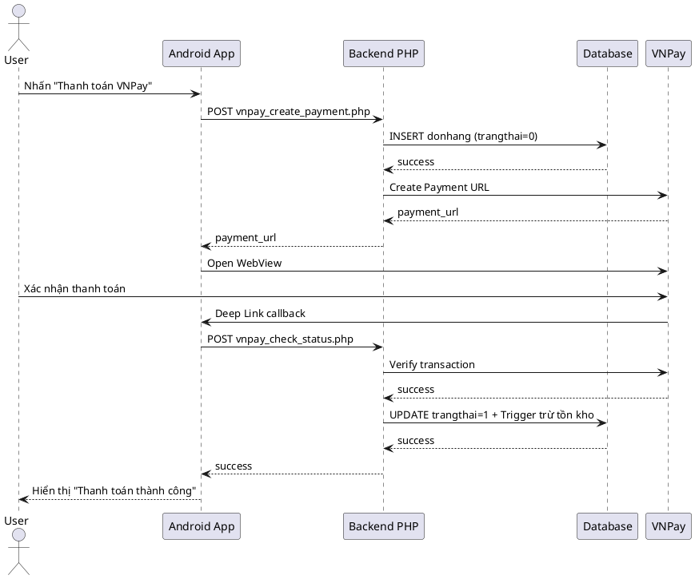

# 📊 TỔNG HỢP CÁC SƠ ĐỒ TRONG DỰ ÁN AppBanDongHo

**Ngày phân tích:** 15/11/2025  
**Người thực hiện:** GitHub Copilot  
**Dự án:** Ứng dụng Bán Đồng Hồ (Android + PHP Backend)

---

## 📋 TỔNG QUAN

Sau khi phân tích toàn bộ dự án, hệ thống hiện tại có **CÁC LOẠI SƠ ĐỒ** sau:

### ✅ **SƠ ĐỒ ĐÃ VẼ:**
1. **Sơ đồ Use Case (Use Case Diagram)** - ✅ **3 phiên bản**
2. **Sơ đồ luồng hoạt động (Flow Diagram)** - ✅ **Dạng văn bản mô phỏng**

### ❌ **SƠ ĐỒ CHƯA VẼ:**
1. **Sơ đồ Sequence (Sequence Diagram)** - ❌ **Chưa có**
2. **Sơ đồ Activity (Activity Diagram)** - ❌ **Chưa có**
3. **Sơ đồ Class (Class Diagram)** - ❌ **Chưa có**
4. **Sơ đồ ERD (Database Design)** - ❌ **Chưa có**
5. **Sơ đồ Component** - ❌ **Chưa có**
6. **Sơ đồ Deployment** - ❌ **Chưa có**

---

## 📊 CHI TIẾT CÁC SƠ ĐỒ ĐÃ VẼ

---

## 1️⃣ SƠ ĐỒ USE CASE (USE CASE DIAGRAM)

### **Số lượng: 3 phiên bản**

### **1.1. Phiên bản đầy đủ nhất (USE_CASE_DIAGRAM_FULL.puml)**

**File:** `USE_CASE_DIAGRAM_FULL.puml`  
**Công cụ:** PlantUML  
**Trạng thái:** ✅ Hoàn chỉnh nhất  
**Tổng số Use Case:** **64 Use Cases**

**Nội dung:**
```
🎯 CÁC NHÓM CHỨC NĂNG:

A. XÁC THỰC & TÀI KHOẢN (7 Use Cases)
   ├─ UC-A1: Đăng ký tài khoản
   ├─ UC-A2: Đăng nhập thường
   ├─ UC-A3: Đăng nhập Google
   ├─ UC-A4: Quên mật khẩu (OTP)
   ├─ UC-A5: Đăng xuất
   ├─ UC-A6: Cập nhật thông tin cá nhân
   └─ UC-A7: Đổi mật khẩu

B. XEM & TÌM KIẾM SẢN PHẨM (5 Use Cases)
   ├─ UC-B1: Xem trang chủ
   ├─ UC-B2: Xem sản phẩm theo danh mục
   ├─ UC-B3: Xem chi tiết sản phẩm
   ├─ UC-B4: Tìm kiếm sản phẩm
   └─ UC-B5: Sắp xếp theo giá

C. GIỎ HÀNG & ĐẶT HÀNG (6 Use Cases)
   ├─ UC-C1: Thêm vào giỏ hàng
   ├─ UC-C2: Xem giỏ hàng
   ├─ UC-C3: Cập nhật số lượng
   ├─ UC-C4: Xóa khỏi giỏ hàng
   ├─ UC-C5: Chọn sản phẩm mua
   └─ UC-C6: Tính tổng tiền

D. THANH TOÁN (5 Use Cases)
   ├─ UC-D1: Nhập thông tin đặt hàng
   ├─ UC-D2: Thanh toán COD
   ├─ UC-D3: Thanh toán VNPay
   ├─ UC-D4: Kiểm tra trạng thái thanh toán
   └─ UC-D5: Tiếp tục thanh toán

E. QUẢN LÝ ĐƠN HÀNG (USER) (4 Use Cases)
   ├─ UC-E1: Xem đơn hàng của tôi
   ├─ UC-E2: Xem chi tiết đơn hàng
   ├─ UC-E3: Hủy đơn hàng
   └─ UC-E4: Theo dõi trạng thái đơn

F. QUẢN LÝ SẢN PHẨM (ADMIN) (5 Use Cases)
   ├─ UC-F1: Vào màn hình quản lý
   ├─ UC-F2: Thêm sản phẩm mới
   ├─ UC-F3: Sửa sản phẩm
   ├─ UC-F4: Xóa sản phẩm
   └─ UC-F5: Upload ảnh sản phẩm

G. QUẢN LÝ TỒN KHO (ADMIN) (4 Use Cases)
   ├─ UC-G1: Xem tồn kho
   ├─ UC-G2: Nhập kho (Tăng tồn)
   ├─ UC-G3: Xuất kho (Giảm tồn)
   └─ UC-G4: Kiểm tra tồn kho tự động

H. QUẢN LÝ ĐƠN HÀNG (ADMIN) (4 Use Cases)
   ├─ UC-H1: Xem tất cả đơn hàng
   ├─ UC-H2: Cập nhật trạng thái đơn
   ├─ UC-H3: Lọc đơn theo trạng thái
   └─ UC-H4: Xem chi tiết đơn user

I. QUẢN LÝ NGƯỜI DÙNG (ADMIN) (4 Use Cases)
   ├─ UC-I1: Xem danh sách người dùng
   ├─ UC-I2: Phân quyền Admin
   ├─ UC-I3: Hạ quyền Admin
   └─ UC-I4: Xóa người dùng

J. QUẢN LÝ VOUCHER (ADMIN) (6 Use Cases)
   ├─ UC-J1: Xem danh sách voucher
   ├─ UC-J2: Thêm voucher mới
   ├─ UC-J3: Sửa voucher
   ├─ UC-J4: Xóa voucher
   ├─ UC-J5: Bật/Tắt voucher
   └─ UC-J6: Xem thống kê voucher

K. SỬ DỤNG VOUCHER (USER) (4 Use Cases)
   ├─ UC-K1: Xem voucher khả dụng
   ├─ UC-K2: Áp dụng mã voucher
   ├─ UC-K3: Kiểm tra điều kiện voucher
   └─ UC-K4: Tính toán giảm giá

L. THỐNG KÊ & BÁO CÁO (ADMIN) (3 Use Cases)
   ├─ UC-L1: Xem thống kê bán hàng
   ├─ UC-L2: Biểu đồ sản phẩm bán chạy
   └─ UC-L3: Thống kê doanh thu

M. HỆ THỐNG (4 Use Cases)
   ├─ UC-M1: Gửi thông báo Push
   ├─ UC-M2: Kiểm tra kết nối Internet
   ├─ UC-M3: Cache hình ảnh
   └─ UC-M4: Lưu trữ offline

👥 ACTORS:
   ├─ User (Người dùng - role=0)
   ├─ Admin (Quản trị viên - role=1) - kế thừa User
   ├─ VNPay Gateway (Hệ thống thanh toán)
   ├─ Firebase Cloud Messaging (Thông báo)
   └─ Google Sign-In (Đăng nhập Google)

📐 QUAN HỆ:
   ├─ Include: 15 quan hệ
   ├─ Extend: 7 quan hệ
   └─ Uses: 8 quan hệ
```

**Cách xem:**
```bash
# Cài đặt PlantUML extension trong VS Code hoặc
# Truy cập: http://www.plantuml.com/plantuml/uml/
# Copy nội dung file USE_CASE_DIAGRAM_FULL.puml vào
```

---

### **1.2. Phiên bản đơn giản (USE_CASE_DIAGRAM.md)**

**File:** `USE_CASE_DIAGRAM.md` (dòng 391-497)  
**Công cụ:** PlantUML  
**Trạng thái:** ✅ Phiên bản cơ bản  
**Tổng số Use Case:** **27 Use Cases**

**Nội dung:**
```
📦 CÁC NHÓM CHỨC NĂNG:

1. Xem sản phẩm (3 Use Cases)
   ├─ UC-G1: Xem danh sách sản phẩm
   ├─ UC-G2: Tìm kiếm sản phẩm
   └─ UC-G3: Xem chi tiết sản phẩm

2. Xác thực (5 Use Cases)
   ├─ UC-A1: Đăng ký
   ├─ UC-A2: Đăng nhập thường
   ├─ UC-A3: Đăng nhập Google
   ├─ UC-A4: Quên mật khẩu (OTP)
   └─ UC-A5: Cập nhật thông tin

3. Mua hàng (8 Use Cases)
   ├─ UC-S1: Thêm vào giỏ hàng
   ├─ UC-S2: Quản lý giỏ hàng
   ├─ UC-S3: Đặt hàng thường
   ├─ UC-S4: Thanh toán VNPay
   ├─ UC-S5: Thanh toán ZaloPay
   ├─ UC-S6: Thanh toán MoMo
   ├─ UC-S7: Xem đơn hàng của tôi
   └─ UC-S8: Hủy đơn hàng

4. Quản trị (8 Use Cases)
   ├─ UC-AD1: Xem tất cả đơn hàng
   ├─ UC-AD2: Cập nhật trạng thái đơn hàng
   ├─ UC-AD3: Quản lý sản phẩm
   ├─ UC-AD4: Thêm sản phẩm
   ├─ UC-AD5: Sửa sản phẩm
   ├─ UC-AD6: Xóa sản phẩm
   ├─ UC-AD7: Quản lý tồn kho
   └─ UC-AD8: Xem thống kê

5. Hệ thống (1 Use Case)
   └─ UC-SYS1: Gửi thông báo Push

👥 ACTORS:
   ├─ Guest (Khách)
   ├─ User (Người dùng) - kế thừa Guest
   ├─ Admin (Quản trị) - kế thừa User
   ├─ VNPay
   ├─ ZaloPay
   ├─ MoMo
   └─ Firebase Cloud Messaging
```

---

### **1.3. Phiên bản đề xuất cải tiến (DANH_GIA_SO_DO_USE_CASE.md)**

**File:** `DANH_GIA_SO_DO_USE_CASE.md` (dòng 196-245)  
**Công cụ:** PlantUML  
**Trạng thái:** ✅ Đề xuất thêm quan hệ  
**Tổng số Use Case:** **~25 Use Cases**

**Nội dung:** 
Bổ sung thêm các quan hệ include/extend chi tiết hơn:
```
- Xem sản phẩm → «include» → Xem chi tiết sản phẩm
- Xem chi tiết sản phẩm → «include» → Kiểm tra tồn kho
- Xem chi tiết sản phẩm → «extend» → Thêm vào giỏ hàng
- Đặt hàng → «include» → Quản lý giỏ hàng
- Thanh toán → «extend» → Thanh toán VNPay
- Thanh toán → «extend» → Thanh toán COD
```

---

## 2️⃣ SƠ ĐỒ LUỒNG HOẠT ĐỘNG (FLOW DIAGRAM - DẠNG VĂN BẢN)

### **Số lượng: 5+ luồng chi tiết**

Các file này mô tả luồng hoạt động dạng văn bản với **ASCII Art** và **step-by-step flow**:

---

### **2.1. Luồng hoạt động Voucher**

**File:** `LUONG_HOAT_DONG_VOUCHER.md`  
**Loại:** Text-based Flow Diagram  
**Trạng thái:** ✅ Chi tiết  

**Các luồng bao gồm:**

**A. Luồng User nhận voucher:**
```
Bước 1: User vào màn hình Thanh toán
   ↓
Bước 2: Nhấn nút "Chọn mã giảm giá"
   ↓
Bước 3: App gọi API getVouchers.php
   - Truyền: user_id, tong_tien
   - Nhận về: vouchers_applicable, vouchers_not_applicable
   ↓
Bước 4: Hiển thị danh sách voucher
   ↓
Bước 5: User chọn voucher → Áp dụng
```

**B. Luồng nhập mã voucher thủ công:**
```
Bước 1: User nhập mã "NEWUSER20"
   ↓
Bước 2: Nhấn nút "Áp dụng"
   ↓
Bước 3: App gọi API checkVoucher.php
   ↓
Bước 4: Server kiểm tra:
   ✓ Mã có tồn tại?
   ✓ Còn hạn?
   ✓ Đơn hàng đủ điều kiện?
   ✓ User đủ điều kiện?
   ↓
Bước 5: Server tính toán giảm giá
   ↓
Bước 6: Trả về kết quả → App hiển thị
```

**C. Luồng đặt hàng với voucher:**
```
Bước 1: User nhấn "Đặt hàng" với voucher
   ↓
Bước 2: App gọi API taoDonHang.php
   - Truyền: voucher_id, ma_voucher
   ↓
Bước 3: Server tạo đơn hàng
   - Lưu thông tin voucher vào bảng donhang
   ↓
Bước 4: Trigger tự động:
   - Cập nhật số lượng đã dùng
   - Thêm vào voucher_usage
   ↓
Bước 5: Trả về kết quả
```

**D. Luồng Admin quản lý voucher:**
```
Bước 1: Admin đăng nhập
   ↓
Bước 2: Chọn menu "Voucher / Mã giảm giá"
   ↓
Bước 3: App gọi API getAllVouchers.php
   ↓
Bước 4: Hiển thị danh sách voucher
   ↓
Bước 5: Admin có thể:
   - Thêm voucher mới
   - Sửa voucher
   - Xóa voucher
   - Bật/Tắt voucher
   - Xem thống kê
```

---

### **2.2. Luồng Logic Giỏ Hàng - Mua Hàng**

**File:** `DANH_GIA_LOGIC_GIO_HANG_MUA_HANG.md`  
**Loại:** Detailed Process Flow (Text)  
**Trạng thái:** ✅ Chi tiết với code snippets

**Luồng tổng thể:**
```
[Chi tiết SP] → [Thêm giỏ hàng] → [Giỏ hàng] → [Chọn SP] → [Đặt hàng] → [Thanh toán] → [Xác nhận]
```

**BƯỚC 1: Thêm Giỏ Hàng (ChiTietActivity)**
```java
// Logic flow:
1. Kiểm tra tồn kho TRƯỚC KHI thêm
   if (tonKhoHienTai <= 0) → return
   
2. Tính số lượng đã có trong giỏ hàng
   for (item in Utils.manggiohang)
      if (item.idsp == currentProduct.id)
         soLuongDaCo = item.soluong
         
3. Kiểm tra tổng số lượng không vượt quá tồn kho
   if (soLuongDaCo + soLuong > tonKhoHienTai) → return
   
4. Nếu sản phẩm đã có → CỘNG THÊM số lượng
   Nếu sản phẩm chưa có → THÊM MỚI
   
5. Đồng bộ lên server (nếu đã đăng nhập)
   syncGioHangToServer()
```

**BƯỚC 2: Giỏ Hàng (GioHangActivity)**
```java
// Checkbox logic:
holder.checckBox.setOnCheckedChangeListener((button, isChecked) -> {
    if (isChecked) {
        Utils.mangmuahang.add(gioHang)
    } else {
        Utils.mangmuahang.remove(i)
    }
    EventBus.getDefault().postSticky(new TinhTongEvent())
})
```

**BƯỚC 3: Đặt Hàng (DatHangActivity)**
```
1. Validate địa chỉ
2. Validate số điện thoại
3. Kiểm tra giỏ hàng không rỗng
4. Gửi request tạo đơn hàng
```

**BƯỚC 4: Backend (taoDonHang.php)**
```php
// Transaction flow:
mysqli_begin_transaction($conn);
try {
    1. Kiểm tra tồn kho TRƯỚC KHI tạo đơn
    2. Tạo đơn hàng
    3. Thêm chi tiết đơn hàng (trigger tự động giảm tồn kho)
    mysqli_commit($conn);
} catch (Exception $e) {
    mysqli_rollback($conn);
}
```

---

### **2.3. Luồng Tồn Kho**

**File:** `HUONG_DAN_TON_KHO.md` (dòng 115+)  
**Loại:** Process Flow Description  
**Trạng thái:** ✅ Chi tiết

**Luồng hoạt động:**
```
1. User xem chi tiết sản phẩm
   ↓
2. ChiTietActivity gọi API kiemTraTonKho.php
   ↓
3. Server trả về số lượng tồn kho
   ↓
4. UI hiển thị với màu sắc:
   - 🔴 Đỏ: Hết hàng (≤ 0) → Vô hiệu hóa nút thêm giỏ
   - 🟠 Cam: Sắp hết (≤ 5)
   - 🟢 Xanh: Còn nhiều (> 5)
   ↓
5. User thêm vào giỏ hàng
   ↓
6. Kiểm tra số lượng không vượt quá tồn kho
   ↓
7. Khi đặt hàng thành công
   ↓
8. Trigger tự động giảm tồn kho trong database
```

---

### **2.4. Luồng VNPay Payment**

**File:** `FIX_LOI_VNPAY_TRU_TON_KHO_2_LAN.md`, `HUONG_DAN_VNPAY_HOAN_CHINH.md`  
**Loại:** Payment Flow  
**Trạng thái:** ✅ Chi tiết fix bug

**Luồng thanh toán VNPay:**
```
1. User chọn VNPay tại ThanhToanActivity
   ↓
2. App gọi API vnpay_create_payment.php
   - Tạo đơn hàng với trangthai = 0 (chưa thanh toán)
   - Không trừ tồn kho ngay
   ↓
3. Redirect đến VNPay với payment URL
   ↓
4. User thanh toán tại VNPay
   ↓
5. VNPay callback về Deep Link: appbandienthoai://vnpay_return
   ↓
6. App gọi API vnpay_check_status.php
   - Verify chữ ký từ VNPay
   - Kiểm tra ResponseCode
   ↓
7a. Nếu thành công (00):
    - Cập nhật trangthai = 1
    - Trigger tự động trừ tồn kho (chỉ 1 lần)
    - Gửi thông báo
    ↓
7b. Nếu thất bại:
    - Xóa đơn hàng
    - Hoàn tồn kho (nếu đã trừ)
```

---

### **2.5. Luồng PayPal Payment**

**File:** `HUONG_DAN_PAYPAL.md`, `PAYPAL_FIXED_SOLUTION.md`  
**Loại:** Payment Flow  
**Trạng thái:** ✅ Chi tiết

**Luồng thanh toán PayPal:**
```
1. User chọn PayPal tại ThanhToanActivity
   ↓
2. App gọi API paypal_create_order.php
   - Chuyển đổi VND → USD
   - Tạo PayPal Order
   ↓
3. Redirect đến PayPal Checkout
   ↓
4. User đăng nhập PayPal và xác nhận
   ↓
5. PayPal callback về Deep Link: appbandienthoai://paypal_return
   ↓
6. App gọi API paypal_capture_payment.php
   - Capture payment từ PayPal
   - Verify payment
   ↓
7. Nếu thành công:
   - Tạo đơn hàng với trangthai = 1
   - Lưu paypal_order_id, paypal_payer_id
   - Trigger trừ tồn kho
```

---

### **2.6. Luồng Quên Mật Khẩu (OTP)**

**File:** `HUONG_DAN_QUEN_MAT_KHAU_OTP.md`  
**Loại:** Authentication Flow  
**Trạng thái:** ✅ Chi tiết

**Luồng reset password:**
```
1. User nhập email tại ResetPassActivity
   ↓
2. App gọi API reset_pass.php
   ↓
3. Server:
   - Kiểm tra email có tồn tại
   - Tạo mã OTP (6 số)
   - Lưu vào database với thời gian hết hạn (15 phút)
   - Gửi email qua PHPMailer
   ↓
4. User nhận OTP qua email
   ↓
5. User nhập OTP và mật khẩu mới
   ↓
6. App gọi API verify_otp_reset_pass.php
   ↓
7. Server:
   - Kiểm tra OTP có đúng và chưa hết hạn
   - Cập nhật mật khẩu mới
   - Xóa OTP khỏi database
   ↓
8. Thành công → Chuyển về màn hình đăng nhập
```

---

### **2.7. Luồng Google Sign-In**

**File:** `HUONG_DAN_DANG_NHAP_GOOGLE.md`, `HUONG_DAN_SUA_LOI_GOOGLE_SIGNIN_SHA1.md`  
**Loại:** OAuth Flow  
**Trạng thái:** ✅ Chi tiết

**Luồng đăng nhập Google:**
```
1. User click nút "Sign in with Google"
   ↓
2. App mở Google Sign-In Dialog
   ↓
3. User chọn tài khoản Google
   ↓
4. Google OAuth xác thực
   ↓
5. App nhận ID Token từ Google
   ↓
6. Gửi ID Token lên Firebase để verify
   ↓
7. App gọi API dangnhap.php
   - email: từ Google Account
   - login_type: "google"
   - Tự động tạo user nếu chưa có
   ↓
8. Server trả về user info (role=0)
   ↓
9. Lưu vào PaperDB và chuyển về MainActivity
```

---

## 3️⃣ BẢNG TÓM TẮT

| STT | Loại Sơ Đồ | Số lượng | Công cụ | File | Trạng thái |
|-----|-------------|----------|---------|------|------------|
| 1 | **Use Case Diagram** | 3 | PlantUML | USE_CASE_DIAGRAM_FULL.puml<br>USE_CASE_DIAGRAM.md<br>DANH_GIA_SO_DO_USE_CASE.md | ✅ Hoàn chỉnh |
| 2 | **Flow Diagram (Text)** | 7+ | Markdown | LUONG_HOAT_DONG_VOUCHER.md<br>DANH_GIA_LOGIC_GIO_HANG_MUA_HANG.md<br>HUONG_DAN_TON_KHO.md<br>FIX_LOI_VNPAY_TRU_TON_KHO_2_LAN.md<br>HUONG_DAN_PAYPAL.md<br>HUONG_DAN_QUEN_MAT_KHAU_OTP.md<br>HUONG_DAN_DANG_NHAP_GOOGLE.md | ✅ Chi tiết dạng văn bản |
| 3 | **Sequence Diagram** | 0 | - | - | ❌ Chưa có |
| 4 | **Activity Diagram** | 0 | - | - | ❌ Chưa có |
| 5 | **Class Diagram** | 0 | - | - | ❌ Chưa có |
| 6 | **ERD Diagram** | 0 | - | - | ❌ Chưa có |
| 7 | **Component Diagram** | 0 | - | - | ❌ Chưa có |
| 8 | **Deployment Diagram** | 0 | - | - | ❌ Chưa có |

---

## 4️⃣ ĐÁNH GIÁ TỔNG QUAN

### ✅ **ĐIỂM MẠNH:**

1. **Use Case Diagram rất chi tiết và chuẩn UML:**
   - 64 Use Cases được phân nhóm rõ ràng
   - Quan hệ include/extend/uses đầy đủ
   - Có legend giải thích
   - Có footer metadata
   - File PlantUML có thể render ra hình ảnh

2. **Flow Diagram dạng văn bản rất chi tiết:**
   - Mô tả từng bước cụ thể
   - Có code snippets minh họa
   - Có API endpoints
   - Có điều kiện rẽ nhánh
   - Dễ đọc và dễ maintain

3. **Tài liệu đầy đủ:**
   - Mỗi flow đều có file markdown riêng
   - Có hướng dẫn vẽ sơ đồ (HUONG_DAN_VE_SO_DO_USE_CASE_DRAWIO.md)
   - Có đánh giá và đề xuất cải tiến

### ⚠️ **ĐIỂM CẦN CẢI THIỆN:**

1. **Thiếu Sequence Diagram:**
   - Chưa có sơ đồ tương tác giữa các đối tượng theo thời gian
   - Khó hình dung message passing giữa Android → Backend → Database

2. **Thiếu Activity Diagram:**
   - Chưa có sơ đồ luồng hoạt động dạng flowchart
   - Flow hiện tại chỉ là văn bản, chưa có visualization

3. **Thiếu Class Diagram:**
   - Chưa có sơ đồ mô tả cấu trúc class
   - Không thấy được quan hệ giữa Model classes

4. **Thiếu ERD Diagram:**
   - Chưa có sơ đồ database
   - Không thấy được quan hệ giữa các bảng

5. **Flow Diagram chỉ dạng Text:**
   - Chưa có visualization bằng Mermaid hoặc PlantUML
   - Khó theo dõi với luồng phức tạp

---

## 5️⃣ ĐỀ XUẤT BỔ SUNG

### **CẦN VẼ THÊM:**

### **1. Sequence Diagram (Ưu tiên cao):**

**Các sequence nên vẽ:**
- Đăng nhập thường (User → App → Backend → DB)
- Đăng nhập Google (User → App → Google OAuth → Backend → DB)
- Thanh toán VNPay (User → App → Backend → VNPay → Backend → App)
- Thanh toán PayPal (User → App → Backend → PayPal → Backend → App)
- Đặt hàng với Voucher (User → App → Backend → DB → Trigger)
- Quên mật khẩu OTP (User → App → Backend → PHPMailer → User)
- Admin cập nhật sản phẩm (Admin → App → Backend → DB)

**Công cụ đề xuất:** PlantUML hoặc Mermaid

**Ví dụ template:**


---

### **2. Activity Diagram (Ưu tiên trung bình):**

**Các activity nên vẽ:**
- Quy trình mua hàng (từ xem SP → đặt hàng → thanh toán)
- Quy trình áp dụng voucher
- Quy trình kiểm tra tồn kho
- Quy trình admin quản lý sản phẩm

**Công cụ đề xuất:** PlantUML hoặc Draw.io

---

### **3. Class Diagram (Ưu tiên trung bình):**

**Các class nên vẽ:**
- Model classes (User, SanPhamMoi, DonHang, GioHang, Voucher...)
- Activity classes
- Adapter classes
- Utils classes

**Công cụ đề xuất:** PlantUML

---

### **4. ERD Diagram (Ưu tiên cao):**

**Các bảng cần vẽ:**
- user
- sanphammoi
- loaisp
- donhang
- chitietdonhang
- giohang
- voucher
- voucher_usage

**Công cụ đề xuất:** dbdiagram.io hoặc MySQL Workbench

---

### **5. Component Diagram (Ưu tiên thấp):**

Mô tả kiến trúc hệ thống:
- Android App (Activities, Services, Adapters)
- Backend PHP (API Endpoints)
- Database (MySQL)
- External Services (VNPay, PayPal, Firebase, Google)

---

### **6. Deployment Diagram (Ưu tiên thấp):**

Mô tả môi trường triển khai:
- Android Device
- XAMPP Server (localhost)
- MySQL Server
- Firebase Cloud
- VNPay/PayPal Gateway

---

## 6️⃣ KẾT LUẬN

### **TỔNG KẾT:**

| Loại Sơ Đồ | Đã có | Cần vẽ thêm | Tổng |
|-------------|--------|-------------|------|
| Use Case Diagram | 3 | 0 | 3 ✅ |
| Flow Diagram (Text) | 7+ | 0 | 7+ ✅ |
| Sequence Diagram | 0 | 7 | 7 ❌ |
| Activity Diagram | 0 | 4 | 4 ❌ |
| Class Diagram | 0 | 1 | 1 ❌ |
| ERD Diagram | 0 | 1 | 1 ❌ |
| Component Diagram | 0 | 1 | 1 ❌ |
| Deployment Diagram | 0 | 1 | 1 ❌ |

**TỔNG CỘNG:**
- ✅ **Đã có:** 10+ sơ đồ/flow (Use Case + Text Flow)
- ❌ **Cần vẽ thêm:** 15+ sơ đồ (Sequence, Activity, Class, ERD, Component, Deployment)

---

### **ƯU TIÊN TRIỂN KHAI:**

**Phase 1 (Quan trọng nhất):**
1. ✅ ~~Use Case Diagram~~ - Đã hoàn thành
2. ❌ **ERD Database Diagram** - Cần vẽ
3. ❌ **Sequence Diagram cho các flow chính** - Cần vẽ

**Phase 2 (Quan trọng):**
4. ❌ **Activity Diagram cho quy trình mua hàng** - Cần vẽ
5. ❌ **Class Diagram** - Cần vẽ

**Phase 3 (Bổ sung):**
6. ❌ **Component Diagram** - Cần vẽ
7. ❌ **Deployment Diagram** - Cần vẽ

---

### **CÔNG CỤ ĐỀ XUẤT:**

| Loại Sơ Đồ | Công cụ đề xuất | Link |
|-------------|-----------------|------|
| Use Case | PlantUML ✅ | http://www.plantuml.com/plantuml/uml/ |
| Sequence | PlantUML / Mermaid | http://www.plantuml.com/plantuml/uml/<br>https://mermaid.live/ |
| Activity | PlantUML / Draw.io | https://app.diagrams.net/ |
| Class | PlantUML | http://www.plantuml.com/plantuml/uml/ |
| ERD | dbdiagram.io / MySQL Workbench | https://dbdiagram.io/ |
| Component | Draw.io / PlantUML | https://app.diagrams.net/ |
| Deployment | Draw.io | https://app.diagrams.net/ |

---

**Ngày tạo:** 15/11/2025  
**Người tạo:** GitHub Copilot  
**Phiên bản:** 1.0

