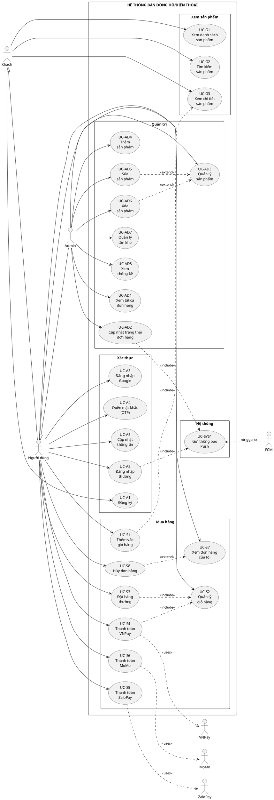

# SƠ ĐỒ USE CASE - ỨNG DỤNG BÁN ĐỒNG HỒ/ĐIỆN THOẠI

## 📋 TỔNG QUAN DỰ ÁN

**Tên dự án:** Ứng dụng Bán Đồng Hồ/Điện Thoại (AppBanDongHo)  
**Nền tảng:** Android (Java)  
**Kiến trúc:** Client-Server (Android App + PHP Backend)  
**Database:** MySQL  
**Thanh toán:** VNPay, ZaloPay, MoMo

---

## 👥 CÁC TÁC NHÂN (ACTORS)


### 2. **Người dùng (User)**
- Khách hàng đã đăng ký/đăng nhập
- Role = 0 trong database
- Có thể mua hàng và quản lý đơn hàng của mình

### 3. **Quản trị viên (Admin)**
- Người quản lý hệ thống
- Role = 1 trong database
- Có toàn quyền quản lý sản phẩm, đơn hàng, thống kê

### 4. **Hệ thống thanh toán (Payment Gateway)**
- VNPay
- ZaloPay
- MoMo

### 5. **Firebase Cloud Messaging (FCM)**
- Gửi thông báo push

---

## 🎯 CÁC USE CASE CHI TIẾT

## A. NHÓM CHỨC NĂNG KHÁCH (GUEST)

### UC-G1: Xem danh sách sản phẩm
- **Mô tả:** Xem tất cả sản phẩm theo danh mục
- **Actor:** Guest, User, Admin
- **Luồng chính:**
  1. Mở ứng dụng (MainActivity)
  2. Xem ViewFlipper banner quảng cáo
  3. Xem danh sách loại sản phẩm (LoaiSp)
  4. Xem sản phẩm mới nhất
  5. Click vào loại sản phẩm để xem chi tiết danh mục
- **API:** `getloaisp.php`, `getspmoi.php`, `chitiet.php`
- **Activity:** `MainActivity`, `DienThoaiActivity`, `LaptopActivity`

### UC-G2: Tìm kiếm sản phẩm
- **Mô tả:** Tìm kiếm và lọc sản phẩm
- **Actor:** Guest, User, Admin
- **Luồng chính:**
  1. Mở trang tìm kiếm (SearchActivity)
  2. Nhập từ khóa tìm kiếm
  3. Sắp xếp theo giá (tăng dần/giảm dần)
  4. Xem kết quả
- **API:** `timkiem.php`
- **Activity:** `SearchActivity`

### UC-G3: Xem chi tiết sản phẩm
- **Mô tả:** Xem thông tin chi tiết của sản phẩm
- **Actor:** Guest, User, Admin
- **Luồng chính:**
  1. Click vào sản phẩm
  2. Xem hình ảnh, tên, giá, mô tả
  3. Xem tồn kho hiện tại
  4. Chọn số lượng (+/-)
- **API:** `kiemTraTonKho.php`
- **Activity:** `ChiTietActivity`

---

## B. NHÓM CHỨC NĂNG XÁC THỰC (AUTHENTICATION)

### UC-A1: Đăng ký tài khoản
- **Mô tả:** Tạo tài khoản mới
- **Actor:** Guest
- **Luồng chính:**
  1. Click "Đăng ký" từ màn hình đăng nhập
  2. Nhập email, mật khẩu, tên, số điện thoại
  3. Xác thực dữ liệu
  4. Gửi request đăng ký
  5. Nhận kết quả và chuyển về màn hình đăng nhập
- **API:** `dangki.php`
- **Activity:** `DangKiActivity`
- **Model:** `User`, `UserModel`

### UC-A2: Đăng nhập thường
- **Mô tả:** Đăng nhập bằng email/password
- **Actor:** User
- **Luồng chính:**
  1. Nhập email và mật khẩu
  2. Click "Đăng nhập"
  3. Xác thực thông tin
  4. Lưu thông tin user vào PaperDB
  5. Chuyển về MainActivity
- **API:** `dangnhap.php`
- **Activity:** `DangNhapActivity`
- **Lưu trữ:** PaperDB (offline storage)

### UC-A3: Đăng nhập Google
- **Mô tả:** Đăng nhập bằng tài khoản Google
- **Actor:** User
- **Luồng chính:**
  1. Click nút "Đăng nhập với Google"
  2. Chọn tài khoản Google
  3. Xác thực với Google Sign-In
  4. Tạo/lấy thông tin user từ server
  5. Đánh dấu loginType = "google"
  6. Lưu thông tin và chuyển về MainActivity
- **API:** `dangnhap.php` (với loginType)
- **Activity:** `DangNhapActivity`
- **Service:** Google Sign-In API

### UC-A4: Quên mật khẩu (OTP)
- **Mô tả:** Đặt lại mật khẩu qua OTP email
- **Actor:** User
- **Luồng chính:**
  1. Click "Quên mật khẩu"
  2. Nhập email
  3. Click "Gửi OTP"
  4. Nhận mã OTP qua email
  5. Nhập OTP và mật khẩu mới
  6. Xác nhận đổi mật khẩu
- **API:** `reset_pass.php`, `verify_otp_reset_pass.php`
- **Activity:** `ResetPassActivity`

### UC-A5: Cập nhật thông tin cá nhân
- **Mô tả:** Sửa tên, email, số điện thoại, đổi mật khẩu
- **Actor:** User
- **Luồng chính:**
  1. Vào menu profile
  2. Click "Cập nhật thông tin"
  3. Sửa các trường thông tin
  4. Với tài khoản Google: không cho đổi password
  5. Với tài khoản thường: có thể đổi password
  6. Click "Cập nhật"
- **API:** `update_profile.php`
- **Activity:** `UpdateProfileActivity`

---

## C. NHÓM CHỨC NĂNG MUA HÀNG (SHOPPING)

### UC-S1: Thêm vào giỏ hàng
- **Mô tả:** Thêm sản phẩm vào giỏ
- **Actor:** User
- **Luồng chính:**
  1. Từ trang chi tiết sản phẩm
  2. Chọn số lượng
  3. Click "Thêm vào giỏ"
  4. Kiểm tra tồn kho
  5. Thêm vào Utils.manggiohang (ArrayList local)
  6. Cập nhật badge số lượng giỏ hàng
- **Lưu trữ:** Local ArrayList (Utils.manggiohang)
- **Activity:** `ChiTietActivity`
- **Model:** `GioHang`

### UC-S2: Quản lý giỏ hàng
- **Mô tả:** Xem, sửa, xóa sản phẩm trong giỏ
- **Actor:** User
- **Luồng chính:**
  1. Click icon giỏ hàng
  2. Xem danh sách sản phẩm đã thêm
  3. Tăng/giảm số lượng từng sản phẩm
  4. Xóa sản phẩm khỏi giỏ
  5. Check/uncheck sản phẩm muốn mua
  6. Xem tổng tiền tự động cập nhật
- **Activity:** `GioHangActivity`
- **Adapter:** `GioHangAdapter`
- **EventBus:** `TinhTongEvent`, `SuaXoaEvent`

### UC-S3: Đặt hàng (Thanh toán thường)
- **Mô tả:** Tạo đơn hàng thanh toán khi nhận hàng
- **Actor:** User
- **Luồng chính:**
  1. Từ giỏ hàng, click "Mua hàng"
  2. Nhập thông tin: địa chỉ, số điện thoại
  3. Xác nhận email
  4. Click "Đặt hàng"
  5. Tạo đơn hàng với trangthai = 0 (Đang xử lý)
  6. Trừ tồn kho sản phẩm
  7. Xóa giỏ hàng
  8. Nhận thông báo thành công
- **API:** `donhang.php`, `capNhatTonKho.php`
- **Activity:** `ThanhToanActivity`
- **Model:** `CreateOrder`, `DonHang`

### UC-S4: Thanh toán VNPay
- **Mô tả:** Thanh toán online qua VNPay
- **Actor:** User, VNPay Gateway
- **Luồng chính:**
  1. Từ trang thanh toán, click "Thanh toán VNPay"
  2. Tạo đơn hàng với trangthai = -1 (Chờ thanh toán)
  3. Gọi API tạo payment URL
  4. Chuyển đến trang VNPay
  5. User thanh toán trên VNPay
  6. VNPay callback về app
  7. Kiểm tra kết quả thanh toán
  8. Nếu thành công: cập nhật trangthai = 0
  9. Nếu thất bại: giữ trangthai = -1 hoặc hủy
- **API:** `vnpay_create_payment.php`, `vnpay_check_status.php`, `vnpay_continue_payment.php`
- **Activity:** `ThanhToanActivity`
- **Model:** `VNPayResponse`, `VNPayStatusResponse`, `VNPayConfig`
- **Deep Link:** vnpay://...

### UC-S5: Thanh toán ZaloPay
- **Mô tả:** Thanh toán online qua ZaloPay
- **Actor:** User, ZaloPay Gateway
- **Luồng chính:**
  1. Click "Thanh toán ZaloPay"
  2. Tạo order ZaloPay
  3. Mở ZaloPay app
  4. Xác nhận thanh toán
  5. Nhận callback kết quả
- **Package:** `vn.duytruong.appbandienthoai.zalo`
- **Helper:** `HMacUtil`, `Helpers`, `HttpProvider`

### UC-S6: Thanh toán MoMo
- **Mô tả:** Thanh toán online qua MoMo
- **Actor:** User, MoMo Gateway
- **API:** `updatemomo.php`

### UC-S7: Xem đơn hàng của tôi
- **Mô tả:** Xem lịch sử đơn hàng đã đặt
- **Actor:** User
- **Luồng chính:**
  1. Vào menu "Đơn hàng của tôi"
  2. Xem danh sách đơn hàng
  3. Phân loại theo trạng thái:
     - -1: Chờ thanh toán
     - 0: Đang xử lý
     - 1: Đang giao
     - 2: Đã giao
     - 3: Đã hủy
  4. Click vào đơn để xem chi tiết
- **API:** `xemdonhang.php` (với iduser)
- **Activity:** `DonHangActivity`, `ChiTietDonHangActivity`
- **Adapter:** `DonHangAdapter`, `ChiTietDonHangAdapter`
- **Model:** `DonHang`, `ChiTietDonHang`

### UC-S8: Hủy đơn hàng
- **Mô tả:** Hủy đơn hàng đang chờ xử lý
- **Actor:** User
- **Luồng chính:**
  1. Từ danh sách đơn hàng
  2. Click "Hủy đơn" (chỉ với đơn chưa giao)
  3. Nhập lý do hủy
  4. Xác nhận hủy
  5. Cập nhật trangthai = 3
  6. Hoàn lại tồn kho
- **API:** `huyDonHang.php`
- **Activity:** `DonHangActivity`

---

## D. NHÓM CHỨC NĂNG QUẢN TRỊ (ADMIN)

### UC-AD1: Xem tất cả đơn hàng
- **Mô tả:** Admin xem toàn bộ đơn hàng của tất cả user
- **Actor:** Admin
- **Luồng chính:**
  1. Admin đăng nhập
  2. Vào "Đơn hàng" (menu admin)
  3. Xem tất cả đơn của user (role=0)
  4. Xem thông tin: tên khách, địa chỉ, SĐT, sản phẩm
- **API:** `xemdonhang.php?isadmin=1`
- **Activity:** `DonHangActivity` (admin mode)
- **Activity Chính:** `XemDonActivity`

### UC-AD2: Cập nhật trạng thái đơn hàng
- **Mô tả:** Admin thay đổi trạng thái đơn
- **Actor:** Admin
- **Luồng chính:**
  1. Từ danh sách đơn hàng
  2. Click "Cập nhật trạng thái"
  3. Chọn trạng thái mới (0→1→2)
  4. Xác nhận
- **API:** `updateorder.php`
- **Activity:** `XemDonActivity`

### UC-AD3: Quản lý sản phẩm
- **Mô tả:** Xem danh sách sản phẩm để sửa/xóa
- **Actor:** Admin
- **Luồng chính:**
  1. Vào menu "Quản lý"
  2. Xem danh sách tất cả sản phẩm
  3. Click vào sản phẩm để sửa hoặc xóa
- **Activity:** `QuanLiActivity`
- **Adapter:** `SanPhamMoiAdapter` (admin mode)
- **EventBus:** `SanPhamEvent`

### UC-AD4: Thêm sản phẩm mới
- **Mô tả:** Tạo sản phẩm mới
- **Actor:** Admin
- **Luồng chính:**
  1. Từ QuanLiActivity, click icon "+"
  2. Nhập: tên SP, giá, hình ảnh (URL), mô tả, loại, tồn kho
  3. Click "Thêm sản phẩm"
  4. Lưu vào database
- **API:** `insertsp.php`
- **Activity:** `ThemSPActivity`

### UC-AD5: Sửa sản phẩm
- **Mô tả:** Cập nhật thông tin sản phẩm
- **Actor:** Admin
- **Luồng chính:**
  1. Từ QuanLiActivity, long-click sản phẩm
  2. Chọn "Sửa"
  3. Sửa thông tin
  4. Click "Cập nhật"
- **API:** `updatesp.php`
- **Activity:** `ThemSPActivity` (edit mode)
- **EventBus:** `SuaXoaEvent`

### UC-AD6: Xóa sản phẩm
- **Mô tả:** Xóa sản phẩm khỏi hệ thống
- **Actor:** Admin
- **Luồng chính:**
  1. Long-click sản phẩm
  2. Chọn "Xóa"
  3. Xác nhận xóa
- **API:** `xoa.php`
- **Activity:** `QuanLiActivity`

### UC-AD7: Quản lý tồn kho
- **Mô tả:** Xem và cập nhật số lượng tồn kho
- **Actor:** Admin
- **Luồng chính:**
  1. Vào menu "Tồn kho"
  2. Xem danh sách sản phẩm với số lượng tồn
  3. Click "Cập nhật" trên sản phẩm
  4. Nhập số lượng mới
  5. Xác nhận cập nhật
- **API:** `getTonKho.php`, `setTonKho.php`, `capNhatTonKho.php`
- **Activity:** `TonKhoActivity`
- **Adapter:** `TonKhoAdapter`
- **Model:** `TonKhoItem`, `TonKhoResponse`

### UC-AD8: Xem thống kê
- **Mô tả:** Xem biểu đồ sản phẩm bán chạy
- **Actor:** Admin
- **Luồng chính:**
  1. Từ QuanLiActivity, click icon thống kê
  2. Xem biểu đồ Bar Chart
  3. Hiển thị top sản phẩm bán chạy
  4. Số lượng đã bán
- **API:** `thongke.php`
- **Activity:** `ThongKeActivity`
- **Model:** `ThongKe`, `ThongKeModel`
- **Library:** MPAndroidChart (BarChart)

---

## E. NHÓM CHỨC NĂNG HỆ THỐNG

### UC-SYS1: Gửi thông báo Push
- **Mô tả:** Gửi notification về đơn hàng
- **Actor:** Firebase Cloud Messaging
- **Kịch bản:**
  - Đơn hàng mới
  - Cập nhật trạng thái đơn
  - Khuyến mãi mới
- **Service:** `FirebaseMessagerReceiver`
- **Badge:** NotificationBadge

### UC-SYS2: Kiểm tra kết nối Internet
- **Mô tả:** Xác thực kết nối mạng trước khi load dữ liệu
- **Activity:** `MainActivity`
- **Method:** `isConnected(Context context)`

### UC-SYS3: Cache hình ảnh
- **Mô tả:** Tải và cache hình ảnh sản phẩm
- **Library:** Glide 5.0.5
- **Strategy:** DiskCacheStrategy, clearCache

### UC-SYS4: Lưu trữ offline
- **Mô tả:** Lưu thông tin user, giỏ hàng local
- **Library:** PaperDB
- **Data:** User credentials, shopping cart

---

## 📊 SƠ ĐỒ USE CASE DIAGRAM (PlantUML)



---

## 🔄 LUỒNG DỮ LIỆU CHÍNH

### 1. Luồng mua hàng (User)
```
Xem sản phẩm → Chi tiết SP → Thêm giỏ hàng → Quản lý giỏ → 
Thanh toán → Chọn phương thức → Tạo đơn → Xác nhận → 
Xem đơn hàng
```

### 2. Luồng quản lý đơn (Admin)
```
Đăng nhập Admin → Menu quản lý → Xem tất cả đơn → 
Cập nhật trạng thái → Gửi thông báo → User nhận notification
```

### 3. Luồng quản lý sản phẩm (Admin)
```
Quản lý SP → Thêm/Sửa/Xóa → Cập nhật tồn kho → 
Xem thống kê
```

---

## 📁 CẤU TRÚC FILE CHÍNH

### Activities (19 files)
- `MainActivity.java` - Màn hình chính
- `DangNhapActivity.java` - Đăng nhập
- `DangKiActivity.java` - Đăng ký
- `ResetPassActivity.java` - Quên mật khẩu
- `UpdateProfileActivity.java` - Cập nhật profile
- `SearchActivity.java` - Tìm kiếm
- `ChiTietActivity.java` - Chi tiết sản phẩm
- `GioHangActivity.java` - Giỏ hàng
- `ThanhToanActivity.java` - Thanh toán
- `DonHangActivity.java` - Đơn hàng
- `ChiTietDonHangActivity.java` - Chi tiết đơn hàng
- `QuanLiActivity.java` - Quản lý (Admin)
- `ThemSPActivity.java` - Thêm/sửa sản phẩm
- `TonKhoActivity.java` - Quản lý tồn kho
- `ThongKeActivity.java` - Thống kê
- `XemDonActivity.java` - Xem đơn (Admin)
- `DienThoaiActivity.java` - Danh mục điện thoại
- `LaptopActivity.java` - Danh mục laptop

### Models (23 files)
- `User.java` - Người dùng
- `SanPhamMoi.java` - Sản phẩm
- `LoaiSp.java` - Loại sản phẩm
- `GioHang.java` - Giỏ hàng
- `DonHang.java` - Đơn hàng
- `ChiTietDonHang.java` - Chi tiết đơn
- `TonKhoItem.java` - Tồn kho
- `ThongKe.java` - Thống kê
- `VNPayResponse.java` - VNPay response
- EventBus models...

### Adapters (8 files)
- `SanPhamMoiAdapter.java`
- `LoaiSpAdapter.java`
- `GioHangAdapter.java`
- `DonHangAdapter.java`
- `ChiTietDonHangAdapter.java`
- `TonKhoAdapter.java`
- `DienThoaiAdapter.java`
- `ChiTietAdapter.java`

### API Backend (PHP)
- `dangnhap.php` - Login
- `dangki.php` - Register
- `getloaisp.php` - Get categories
- `getspmoi.php` - Get products
- `chitiet.php` - Product by category
- `donhang.php` - Create order
- `xemdonhang.php` - View orders
- `updateorder.php` - Update order status
- `insertsp.php` - Add product
- `updatesp.php` - Update product
- `xoa.php` - Delete product
- `kiemTraTonKho.php` - Check stock
- `capNhatTonKho.php` - Update stock
- `thongke.php` - Statistics
- `vnpay_*.php` - VNPay integration
- `huyDonHang.php` - Cancel order
- `reset_pass.php` - Reset password OTP
- `verify_otp_reset_pass.php` - Verify OTP

---

## 🔐 PHÂN QUYỀN

| Chức năng | Guest | User | Admin |
|-----------|-------|------|-------|
| Xem sản phẩm | ✅ | ✅ | ✅ |
| Tìm kiếm | ✅ | ✅ | ✅ |
| Đăng ký/Đăng nhập | ✅ | - | - |
| Mua hàng | ❌ | ✅ | ✅ |
| Xem đơn của tôi | ❌ | ✅ | ✅ |
| Hủy đơn | ❌ | ✅ | ❌ |
| Quản lý sản phẩm | ❌ | ❌ | ✅ |
| Xem tất cả đơn | ❌ | ❌ | ✅ |
| Cập nhật trạng thái đơn | ❌ | ❌ | ✅ |
| Quản lý tồn kho | ❌ | ❌ | ✅ |
| Thống kê | ❌ | ❌ | ✅ |

---

## 💡 CÔNG NGHỆ SỬ DỤNG

### Frontend (Android)
- **Language:** Java
- **Min SDK:** 24 (Android 7.0)
- **Target SDK:** 36
- **Architecture:** MVC
- **Networking:** Retrofit 2.9.0, RxJava2, Volley
- **Image Loading:** Glide 5.0.5
- **Local Storage:** PaperDB
- **Event Bus:** GreenRobot EventBus 3.3.1
- **Charts:** MPAndroidChart (BarChart)
- **Auth:** Google Sign-In, Firebase Auth
- **Push Notification:** Firebase Cloud Messaging
- **Payment SDKs:** VNPay, ZaloPay (AAR), MoMo

### Backend
- **Language:** PHP
- **Database:** MySQL
- **Email:** PHP Mailer (OTP)

---

## 📈 KẾT LUẬN

Đây là một ứng dụng bán hàng e-commerce hoàn chỉnh với:
- **30+ Use Cases** được phân loại rõ ràng
- **3 loại Actor** (Guest, User, Admin)
- **19 Activities** xử lý logic nghiệp vụ
- **Tích hợp 3 cổng thanh toán** (VNPay, ZaloPay, MoMo)
- **Hệ thống phân quyền** rõ ràng (role-based)
- **Push notification** realtime
- **Quản lý tồn kho** tự động
- **Thống kê báo cáo** bằng biểu đồ

Dự án được xây dựng theo chuẩn kiến trúc MVC, code sạch, dễ bảo trì và mở rộng.

